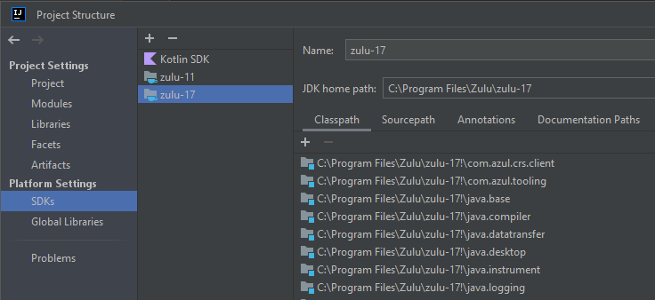
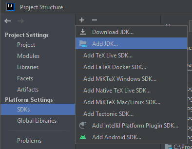
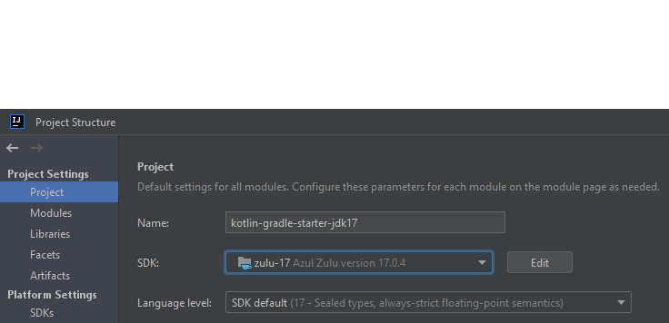
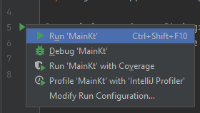
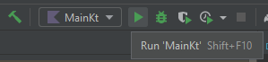
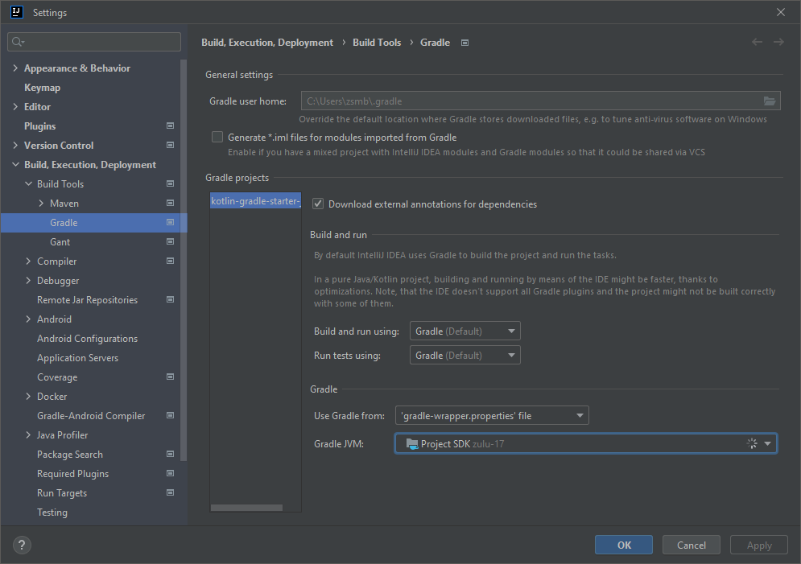
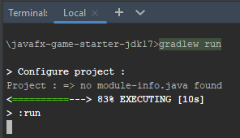
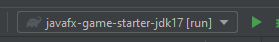

# JDK setup

This page describes how to set up JDKs (builds of the Java Development Kit) on your machine and in your Gradle-based Kotlin projects.

* [Choosing and downloading JDKs](#choosing-and-downloading-jdks)
* [Adding JDKs to IntelliJ](#adding-jdks-to-intellij)
* [Setting the JDK to use in your project](#setting-the-jdk-to-use-in-your-project)
  * [The project JDK](#the-project-jdk)
  * [The Gradle JDK](#the-gradle-jdk)

For more about managing SDKs, see the [SDKs page](https://www.jetbrains.com/help/idea/sdk.html) of the IDEA documentation.

## Choosing and downloading JDKs

Kotlin isn't strongly tied to JDK versions in general. New language features depend on the Kotlin language version (Gradle plugin + standard library version) and not on the JDK version being used.

The oldest supported JDK to use at the moment is JDK 8, and Kotlin compiles to Java 1.8 bytecode by default. However, it's a good idea to **use the** latest stable, or the **latest stable LTS (long-term support) version of the JDK** for the best experience. This course will generally work with **JDK 17**.

There are many distributions of JDK available that you can choose from. If you don't have any other preference, [Azul's Zulu JDK](https://www.azul.com/downloads/?version=java-17-lts&package=jdk) is a popular build of OpenJDK.

## Adding JDKs to IntelliJ

The list of configured JDKs in IntelliJ can be checked by going to the *SDKs* tab of the *Project structure* dialog. These are the SDKs that will be available to choose for your projects.

After downloading a new JDK, you can use the *Add JDK...* option to browse for it and add it to IntelliJ. 

(You can also use the *Download JDK...* option in this menu to download a new JDK of your choice and add it in one easy step.)

## Setting the JDK to use in your project

Setting the correct JDK in IntelliJ IDEA can be tricky sometimes, as it has to be set correctly in two different places. It's highly recommended to use the same JDK in both places.

### The project JDK

Set your JDK in the project settings (*File -> Project Structure -> Project tab*):

This is the JDK that will be used when you run an application from the IDE, for example, by using the *Play* icon in the gutter:

... or next to a Kotlin run configuration:

### The Gradle JDK

Go to the global IDE settings (*File -> Settings*), and check that Gradle (*Build, Execution, Deployment -> Build Tools -> Gradle*) is set to use the same JDK as the project. This can either be set explicitly, or by choosing to use the Project SDK:

This is the JDK that will be used by Gradle, which happens when you invoke Gradle build commands from the command line:

... or use a Gradle run configuration:

