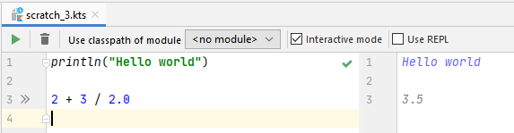
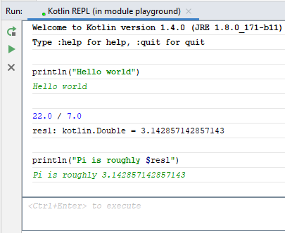

# Chapter 1: Introduction - Extras

### Scratch files

[Scratch files](https://www.jetbrains.com/help/idea/scratches.html) are temporary files that you can use to quickly write and run Kotlin code. They are not associated with any project, and they reside outside your project directory, so they won't be under version control, but only stored locally.

Despite this, you can reference code in your current project from a scratch file, if you need to. You can create instances of classes, call existing functions, and so on. This makes it really, really easy to perform quick experiments.

To create a scratch file, go to *File -> New -> Scratch File*.

### REPL

Read-Eval-Print Loops, or REPLs, are usually a tool for scripting languages. They allow you to write and execute code line by line, to quickly iterate and try out various things in the language.

Kotlin comes with this tool as well, which you can either run from the command line, or right inside IntelliJ IDEA (*Tools -> Kotlin -> Kotlin REPL*). Just like with scratch files, you can call into code in your currently open project from the REPL.

