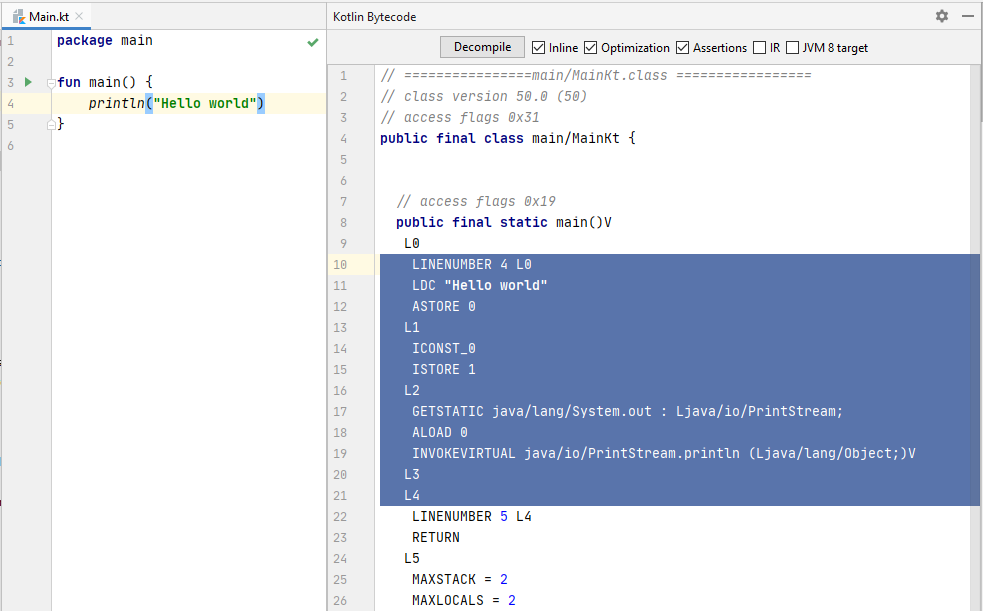
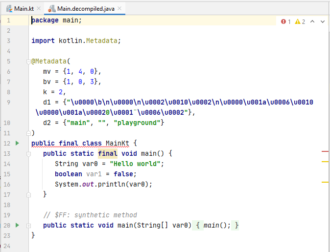
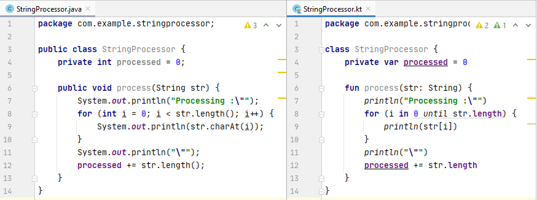

# Chapter 1: Introduction

Kotlin is a great example of a modern, general-purpose programming language. It's **concise, multiplatform, and fun** - that's what [the official website](https://kotlinlang.org/) says!

Of course, programming languages are hardly unique these days. Many of them share the same ideas, attributes, and features. You might recognize features in Kotlin that you've already seen in various other languages.

So why should you start using Kotlin specifically, out of all these languages? Its creators often say that they don't really want to push Kotlin on anyone, they want it to speak for itself. It's a very **pragmatic** language, meant to solve real problems. Try it, see if it solves problems that you're facing with other languages, and if that's valuable for you. There's really no substitute for seeing what it's like to use in practice!


<p align="center"><i>Kotlin's mascot, Kodee, doing whatever Kodee does</i></p>

The language designers also proudly admit that almost none of the features in Kotlin have been invented from scratch. We all stand on the shoulders of giants, there's nothing new under the sun, and [everything is a remix](https://www.youtube.com/watch?v=nJPERZDfyWc). We take existing ideas and combine them into something new. Creating a language is no different from your everyday coding in this regard.

> The original lead language designer for Kotlin, Andrey Breslav gave an [excellent talk](https://www.youtube.com/watch?v=7z_K-hTTeqI) on how Kotlin builds on other languages in 2022. Best watched once you're already familiar with Kotlin.

What *does* make Kotlin unique is how well its features fit together, and what features were omitted on purpose, because they would have broken the language's consistency, or go against its core tenets.

Here are some of Kotlin's main goals:

- **Conciseness**, i.e. using less code for expressing the same ideas. Not for the sake of conciseness itself, but to improve **readability** compared to more verbose languages. Not having to write [boilerplate code](https://en.wikipedia.org/wiki/Boilerplate_code) makes coding faster, and more importantly, not having that boilerplate in your codebase makes navigating and reading your existing code a lot easier.
- **Safety** means that your program misbehaves as little as possible. There's various ways to achieve such safety at the language level. Kotlin does this by having a *strong, static type system*, which reveals most mistakes at compile time (at edit time, really, in almost all cases), rather than letting your code fail at runtime.
- **Interoperability** is another driving principle of Kotlin. It runs on multiple platforms, and on each of them it cooperates with the native environment and libraries as much as possible. We'll look specifically at how it interops with Java when running it on the JVM.
- **Pragmatism** is a way of saying that Kotlin is not an academic language. It's meant for use in real industrial settings, and to solve real, practical problems.
- **Tooling** is something you might overlook at first when evaluating languages, but it's something that can make a good language a true pleasure to use. While there are still proud Vim warriors out there, most developers are used to using rich IDEs for their coding needs, and Kotlin's tooling is as first-party as it gets.

This brings us to Kotlin's origin story.

## History

[JetBrains](https://www.jetbrains.com/), the company behind the IntelliJ platform (and [the IDEs that are built on it](https://www.jetbrains.com/ides/), such as IntelliJ IDEA, CLion, PyCharm, and so on) has been developing their products in Java for a decade by 2010. During this time, they've built up immense experience in creating tooling for programming languages, and they also got very familiar with Java's pros and cons.

It was at this time that they started looking for a new language for their own development needs that was better than Java. They've evaluated the existing languages that ran on the Java Virtual Machine (JVM), but they didn't find one at the time that would've satisfied their needs.

> The closest candidate at the time was Scala, but it was notoriously difficult to make tooling for, and it suffered from lengthy compilation times.

So they've done what anyone else would've done at this point - created their own.

This, in general, is not a great idea. It's akin to writing your own date library or [rolling your own crypto](https://security.stackexchange.com/questions/18197/why-shouldnt-we-roll-our-own). But with the tooling and language expertise at JetBrains, they've deemed it a viable project, and got started on it.

Here's a high-level overview of how the language developed since then:

| Date          | Event                                                                                                                                             |
|---------------|---------------------------------------------------------------------------------------------------------------------------------------------------|
| 2010          | Internal development started under the name "JetLang"                                                                                             |
| July 2011     | [Announced to the public](https://blog.jetbrains.com/kotlin/2011/07/hello-world-2/) as Project Kotlin                                             |
| February 2016 | **[Kotlin 1.0](https://blog.jetbrains.com/kotlin/2016/02/kotlin-1-0-released-pragmatic-language-for-jvm-and-android/), the first stable release** |
| March 2017    | [Version 1.1](https://blog.jetbrains.com/kotlin/2017/03/kotlin-1-1/), the first major feature update to Kotlin, with initial JavaScript support   |
| May 2017      | **First-class Android support for Kotlin [announced at Google I/O](https://www.youtube.com/watch?v=9C3-HcP5xBI)**                                 |
| November 2017 | [Version 1.2](https://blog.jetbrains.com/kotlin/2017/11/kotlin-1-2-released/), with the first version of multiplatform projects                   |
| October 2018  | [Version 1.3](https://blog.jetbrains.com/kotlin/2018/10/kotlin-1-3/), coroutines becoming stable                                                  |
| May 2019      | Android development going [Kotlin-first](https://developer.android.com/kotlin/first) announced at Google I/O                                      |
| August 2020   | [Version 1.4](https://blog.jetbrains.com/kotlin/2020/08/kotlin-1-4-released-with-a-focus-on-quality-and-performance/), introducing a new compiler |
| May 2021      | [Version 1.5](https://blog.jetbrains.com/kotlin/2021/05/kotlin-1-5-0-released/), stabilizing inline classes, adding improvements to sealed types  |
| November 2021 | [Version 1.6](https://blog.jetbrains.com/kotlin/2021/11/kotlin-1-6-0-is-released/), with a preview of the new Kotlin/Native memory model          |
| June 2022     | [Version 1.7](https://blog.jetbrains.com/kotlin/2022/06/kotlin-1-7-0-released/), with the new K2 compiler available in alpha                      |
| January 2023  | [Version 1.8](https://blog.jetbrains.com/kotlin/2023/01/kotlin-1-8-0-released/)                                                                   |
| August 2023   | [Version 1.9](https://kotlinlang.org/docs/whatsnew19.html), the last major release before moving to the new compiler                              |
| October 2023  | **[Kotlin Multiplatform is stable](https://blog.jetbrains.com/kotlin/2023/11/kotlin-multiplatform-stable/)**                                      |
| May 2024      | **[Kotlin 2.0](https://blog.jetbrains.com/kotlin/2024/05/celebrating-kotlin-2-0-fast-smart-and-multiplatform/)**                                  |

> These documentaries tell the detailed history of the language and its creators: 
> * [Ten Years of Kotlin: The Story of The Programming Language](https://www.youtube.com/watch?v=uE-1oF9PyiY), 20 minutes, official content by JetBrains
> * [Beyond The Success Of Kotlin](https://www.youtube.com/watch?v=E8CtE7qTb-Q), 90 minutes, community-created (by EngX)

> Read the blog post from Google [celebrating 5 years of Kotlin on Android](https://android-developers.googleblog.com/2022/08/celebrating-5-years-of-kotlin-on-android.html).

Let's take a moment to review some of the previously mentioned language attributes, with this history now in mind:

- **Interoperability**: JetBrains had hundreds of thousands of lines of Java code in IntelliJ that they could never just throw away. The new code written in Kotlin and the old code written in Java had to be able to communicate efficiently and effortlessly.
- **Pragmatism**: The language was born to serve a specific need, a real industrial project.
- **Tooling**: Language and tooling could be developed side-by-side, in-house, and complement each other perfectly.

---

Today, Kotlin is used by millions of developers for building desktop and server-side applications, it's the primary language of Android development, and it's used to build cross-platform applications for mobile and beyond with [Kotlin Multiplatform](https://www.jetbrains.com/kotlin-multiplatform/). To learn more about how Kotlin is being used, take a look at the [State of Developer Ecosystem survey (2023)](https://www.jetbrains.com/lp/devecosystem-2023/kotlin/) ran by JetBrains.

Kotlin is open-source. Everything around it - the compiler, the standard library, docs, and so on - are available [on GitHub](https://github.com/JetBrains/kotlin). JetBrains isn't the sole owner and controller of the language: its development is governed by the [Kotlin Foundation](https://kotlinfoundation.org/), co-founded by JetBrains and Google, with more members joining since.

Being an open source project, it's rare that surprise product announcements for Kotlin appear, as everything is developed out in the open in the first place. You can take a look at what's planned to be coming up for Kotlin in the next few months (or years) on the [Kotlin roadmap](https://kotlinlang.org/docs/roadmap.html).

## Compilation

Kotlin is a multiplatform [application programming language](https://medium.com/@elizarov/application-programming-language-ff7f0063c16). Its original and primary target is the JVM, but Kotlin code can also be compiled to [native](https://kotlinlang.org/docs/native-overview.html) binaries, [JavaScript](https://kotlinlang.org/docs/js-overview.html), and even [Wasm](https://kotlinlang.org/docs/wasm-overview.html).

In this course, we'll primarily focus on using Kotlin on the JVM. When compiling `.kt` Kotlin sources, the output here is *bytecode* in the form of `.class` files - the same as when compiling Java code.


What makes this compilation interesting is the strong interoperability between Kotlin and Java. Code written in one language can call into the other one completely seamlessly. So how can this work out during compilation, if we need to compile Java and Kotlin with their respective compilers? How would the Java compiler know about declarations in Kotlin sources, and vice versa?

Here's how the compilation actually works ([credits to Jake Wharton](https://youtu.be/CtZL_IjR5Ww?t=378)):


The Kotlin compiler, `kotlinc` runs first, and it parses both Java and Kotlin sources. This allows it to compile Kotlin code that references declarations in the Java sources. Next, the Java compiler `javac` is invoked. This again parses the Java sources, plus it receives the output of the Kotlin compiler as already compiled bytecode, which is what allows Java sources to reference Kotlin declarations. Finally, the merged output of these two compilers is bytecode in `.class` files.

## Tooling and environment

Unsurprisingly, JetBrains works very hard to provide the best possible tooling for Kotlin. After all, this is their business angle with the language: building products with it, and selling the tooling for it.

Therefore, [IntelliJ IDEA](https://www.jetbrains.com/idea/) is the definitive IDE for Kotlin development, although other editors support it as well. You can also download the Kotlin compiler and [compile it from the command line](https://kotlinlang.org/docs/command-line.html), if that's your thing.

> [Android Studio](https://developer.android.com/studio) is based on IntelliJ IDEA and offers the same support for Kotlin (although new features from IDEA take a while to trickle down to Studio releases).

> [Fleet](https://www.jetbrains.com/fleet/) by JetBrains is currently in preview, and it's also an option for Kotlin development, including the latest Kotlin multiplatform tooling.

Most non-trivial JVM projects use build tools instead of invoking the compiler directly. Kotlin supports both [Maven](https://kotlinlang.org/docs/maven.html) and [Gradle](https://kotlinlang.org/docs/gradle.html), which are the popular build tools in the JVM world. Gradle, which also happens to be the de-facto build system for Android projects, is generally preferred.

> Kotlin is also the default language for writing Gradle build scripts ([since early 2023](https://blog.jetbrains.com/kotlin/2023/04/kotlin-dsl-is-the-default-for-new-gradle-builds/)). 

IntelliJ IDEA has a suite of convenient tools built-in for working with Kotlin. Let's take a quick look at the most important ones before we get to the code.

### Decompiler

Sometimes the easiest way to understand what a certain piece of Kotlin code does is to look at what it compiles to. The bytecode that the compiler will output for a given Kotlin source file can be viewed by going to *Tools -> Kotlin -> Show Kotlin Bytecode*.



While this can help you figure out what's happening in some cases, most people can't read bytecode very well (nor should they be required to), so there's an even more important feature here. You can decompile this bytecode to Java by choosing the *Decompile* option on the bytecode viewer panel.



This gives you a Java source file, which is an attempt at writing Java code that would result in the same compilation result. Keep in mind that this is a best effort step, and not all the bytecode that the Kotlin compiler produces can be represented by Java code in a straightforward way. Most of the time, this decompiled Java code will contain at least a few errors. Still, the decompiler is a very useful tool for gaining a deeper understanding of Kotlin.

### Java-to-Kotlin converter

The Kotlin plugin IntelliJ IDEA also ships with a feature that lets you go the other way around: take existing Java code, and automatically convert it to Kotlin. This comes in really handy when migrating a project to Kotlin.



> You'll find this action under  *Code -> Convert Java File to Kotlin File* when you have a Java file open.

Keep in mind that just like the decompiler, this isn't a perfect tool either. Occasionally the converted Kotlin code won't compile straight away, or it will have some bugs in it. Often it might be messy, Java-like, and require some cleanup to make it more _idiomatic_ Kotlin. But it's usually a good start.

The best use of this feature is perhaps for learning purposes. If you don't know how to express something in Kotlin, but you can write it down in Java, you can always run it through the converter! Again, this might not give you the best possible Kotlin solution, but it'll at least give you one.

> Bonus: pasting Java code into a `.kt` file will also prompt you about converting that code into Kotlin while the paste operation is happening.

## Basic syntax

### Variables

Let's take the first thing you'd want to do in a language, and declare a variable!

> Note: In the beginning, we'll look at the Java equivalents of the Kotlin code in case you need them for reference. Remember, Kotlin *does not* actually compile to Java!

```kotlin
var x: Int = 0              // int x = 0;
```

Let's note a couple of things:
- You declare variables with the `var` keyword.
- The variable name *precedes* the type.
- Semicolons are... allowed, but optional (in practice, this means that you won't use them).

You should only use `var` when you explicitly want a *mutable* **var**iable.

If that's not the case, use `val` instead, which declares an *immutable* **val**ue.

```kotlin
val y: Int = 1              // final int y = 1;
```

That's better. When declaring variables, `val` should be your default choice.

We can make another improvement to this declaration, by making use of *type inference*.

```kotlin
val z = 2                   // final int z = 2;
```

Kotlin is statically typed and has a strong, strict type system. This variable still has a type of `Int`, but you can omit the type from your code, as the compiler can *infer* it from context (in this case, from the value being assigned). You'll see a lot of this happening in Kotlin code.

This mechanism means you'll never type out something as verbose as this again:

```java
final FileInputStream fis = new FileInputStream("filename");
```

Instead, you'll have the Kotlin compiler figure out the type for you in almost all cases:

```kotlin
val fis = FileInputStream("filename")
```

> Note: You may also notice here that there's no `new` keyword in Kotlin for constructor calls.

The simple number literal we had before was inferred to be an `Int`, but you can also use special formats to create other basic numerical types:

```kotlin
val myLong = 1L             // final long myLong = 1;
val myFloat = 1f            // final float myFloat = 1;
val myDouble = 1.0          // final double myDouble = 1;
```

#### Primitives vs boxed types

Java - and the JVM itself - makes a distinction between primitive types and boxed types. Primitives (`int`, `double`, `boolean`, and so on) are much more efficient, as they live on the stack, and only take up the space required to represent them.

The corresponding boxed classes (`Integer`, `Double`, `Boolean`, and more) are reference types, so only references to them are stored on the stack, and their actual instances live on the heap. These instances are also larger than the primitive's size, [sometimes significantly](https://dzone.com/articles/whats-wrong-with-java-boxed-numbers).

Using the primitives is sufficient in most cases, but sometimes the boxed variants are still required. This can happen when you *need* an object for some reason, for example when dealing with generics (there's no `List<int>` in Java!). The boxed instances also have various methods you can call on them, which you can't do with a primitive value.

So where does Kotlin's `Int` (and `Boolean`, and `Double`, and other numeric types) fit in this picture? Well, just like `Int` is sort of between `int` and `Integer` by its looks, its semantics lie somewhere in the middle as well. On the Kotlin language level, we don't make a distinction about primitives and boxed types. The compiler will use a primitive whenever it's possible, and use a boxed type automatically when it needs to.

This doesn't exactly mean that we *never* have to think about this problem, because the performance considerations of what happens under the hood are still important in some cases - but we won't use different types to represent these things in our code.

#### Strings

The last basic type that's worth mentioning here is `String`, which is much like a `String` in Java. A literal is declared with quotation marks:

```kotlin
val name = "Sarah"           // final String name = "Sarah";
```

Kotlin also supports *string templates*, which is an easy way to place values inside a `String`, without having to use lots of concatenation:

```kotlin
val sum = "$x + $y + $z = ${x + y + z}"     // outputs "0 + 1 + 2 = 3"
```

Single values can be inserted with just a `$` prefix, and expressions can be computed using additional curly braces `${...}`.

### Functions

#### Our first function

Let's move on to functions, something we'll discuss *a lot* in Kotlin. First, we'll convert this very simple function - which just adds two numbers together, and returns the result - to Kotlin.

```java
int add(int x, int y) {
    return x + y;
}
```

Here's a Kotlin equivalent of this code:

```kotlin
fun add(x: Int, y: Int): Int {
    return x + y
}
```

Some important observations about the syntax:

- We use the `fun` keyword to declare a function. Yay! 🎉
- The names precede the types in the parameter list, just like we've seen with variables.
- The return type comes after the rest of the function header as well, following the `name: Type` structure yet again.

For functions as simple as this one, that only evaluate a single expression and return its value, Kotlin offers a shorthand syntax called an *expression body*:

```kotlin
fun add(x: Int, y: Int): Int = x + y
```

Type inference can also be used here, since the type of the `x + y` expression, an addition of two `Int` values is known by the compiler to be an  `Int`:

```kotlin
fun add(x: Int, y: Int) = x + y
```

This function still returns `Int`, but we aren't stating this explicitly.

> Use expression bodies with care, usually when the function's implementation is truly a simple one-liner. Otherwise, don't be afraid of using a traditional function body.

#### Functions that don't return anything

There's another case where the return type can be omitted, this is when the function doesn't return anything. This is equivalent to a function having a `void` return type in Java.

```kotlin
fun noReturnValue() {
    /* Empty */
}
```

Technically, functions like this still do return *something* in Kotlin. The language doesn't have the super special case that Java has with `void` functions. Functions where you don't return a meaningful value - like the one above - will implicitly have a return type of `Unit`. You can also write this out explicitly, although the IDE will warn you that it's unnecessary.

```kotlin
fun noReturnValue(): Unit {
    /* Empty */
}
```

`Unit` is an empty class that has a single instance. It's a dummy object with no properties or methods. This makes it perfect for representing "no meaningful value". Returning this from methods like the one above yields some... interesting possibilities. For example, you can assign the return value of this function to a variable, just like you could with any other function that returns any regular type.

```kotlin
val result: Unit = noReturnValue()
println(result) // kotlin.Unit
```

Again, there's no hard distinction between functions that do return something, and functions that don't. If there's nothing to return, we're indicating that by returning `Unit` implicitly (both the declaration of the return type and the actual `return` statement at the end of the function may be implicit).

We'll see that this type also plays well with generics. We won't need the weird distinction that Java makes between `void` and `Void`, we'll just use `Unit` for everything. But we're getting ahead of ourselves. Spoilers!

#### Default and named parameter values

Functions come with some neat new features in Kotlin compared to Java functions. One of these is [*default arguments*](https://kotlinlang.org/docs/functions.html#default-arguments).

> *Arguments* are the concrete values passed in for the *parameters* that a function declares. However, the words "argument" and "parameter" are often used interchangeably.

To demonstrate, let's write a function that mimics the registration of a user.

```kotlin
fun register( 
    username: String, 
    password: String = "12345678", 
    email: String = "",
) {
    // Pretend that there's something useful here.
    println("$username $password $email")
}
```

This function takes three parameters, and it defines default argument values for the last two. Note the formatting of each parameter on a separate line, this is conventional in Kotlin for functions with long signatures.

> Since Kotlin 1.4, Kotlin allows [trailing commas](https://kotlinlang.org/docs/reference/whatsnew14.html#trailing-comma) in places like parameter lists. You might have noticed this in the previous snippet. This makes it easier to rearrange lines (even in simple text editors), and also makes version control history neater.

Having these default arguments in place means that we can call this method with three, two, or just one argument. For any parameters that are not provided, the default value will be used instead.

```kotlin
register("piglet", "0h_d34r", "piglet@hundred-acre-wood.co.uk")
register("owl", "tea_party")
register("eeyore")
```

Another feature that works nicely in conjunction with default values is [*named arguments*](https://kotlinlang.org/docs/functions.html#named-arguments). For any function defined in Kotlin, you can optionally specify the names of the arguments when you call the function. Our previous calls could be made like this (note the formatting of the lengthy call, on multiple lines):

```kotlin
register(
    username = "piglet",
    password = "0h_d34r",
    email = "piglet@hundred-acre-wood.co.uk"
)
register(username = "owl", password = "tea_party")
register(username = "eeyore")
```

Naming arguments - especially in cases like this where several of the same type are being passed in - can help us avoid mixing up their order, making the code safer. It also improves readability, as which argument fulfills which parameter is immediately clear at the call site.

Combined with default values, we can also use this to omit arguments that have default values, but are not at the end of the parameter list:

```kotlin
register("tigger", email = "tigger@hundred-acre-wood-co.uk")
```

Here, we're passing in a value for `email`, but opting to use the default value for the `password` parameter.

> By default, Java clients of a Kotlin function with default arguments must provide all arguments, and can't make use of the default arguments. However, you can add the [`@JvmOverloads`](https://kotlinlang.org/api/latest/jvm/stdlib/kotlin.jvm/-jvm-overloads/) annotation to improve interoperability:
>
> ```kotlin
> @JvmOverloads
> fun register( 
>     username: String, 
>     password: String = "12345678", 
>     email: String = "",
> )
> ```
>
> This will generate overloaded methods that are callable by Java clients. For each parameter with a default value (starting from the end of the parameter list), a new method will be generated, which omits that parameter, and uses the default value for it instead.
>
> ```java
> register("kanga");
> register("kanga", "roo");
> register("kanga", "roo", "kanga.and.roo@hundred-acre-wood.co.uk");
> ```
>
> Note how this makes parameter ordering quite important, as parameters can only be omitted from the end of the list. For example, you could not omit just the second `password` parameter when calling from Java. Make sure you're placing your most-defaulted parameters as far back in the parameter list as possible!
>
> We'll take note of similar interop features along the course. There's also a dedicated [documentation page](https://kotlinlang.org/docs/java-to-kotlin-interop.html) covering these.

### Control structures

Let's continue with the basics and get to know our [control structures](https://kotlinlang.org/docs/control-flow.html). Most of these will be familiar already, so you'll have no problem getting started with them, but Kotlin does offer some extra capabilities here that are worth knowing about.

#### Conditionals

The classic [`if` statement](https://kotlinlang.org/docs/control-flow.html#if-expression) is available in Kotlin just like you'd expect:

```kotlin
if (age < drinkingAge) {
    println("We can't serve you")
} else {
    println("Have a beer")
}
```

It comes with the exciting twist of being not only a statement, but also an *expression*, i.e. it has a return value. This return value is whatever the last expression is in the branch that was executed.

```kotlin
val discount = if (age < adultAge) {
    println("Calculating discount")
    val diff = adultAge - age
    100 - diff * 5
} else {
    println("No discount available")
    0
}
```

If you omit the braces, you get a very concise syntax for these expressions:

```kotlin
val max = if (a > b) a else b
```

For this reason, the so-called ternary operator (`a > b ? a : b`) is not present in the language (see [detailed discussion](https://youtrack.jetbrains.com/issue/KT-5823) and [conclusion with explanation](https://www.youtube.com/watch?v=0FF19HJDqMo&t=1357s)).

#### Switches get ~~stitches~~ improvements

The well-known `switch` statement is an interesting control structure. Many languages (Scala, Swift, or C#, just to mention a few) have taken it beyond its original capabilities by adding *pattern matching* of various kinds to it.

How does Kotlin measure up? Like in most times when it's compared on a scale from Java to Scala, it's somewhere in the comfortable middle.

Kotlin's replacement for the `switch` is the [`when` expression](https://kotlinlang.org/docs/control-flow.html#when-expression). First of all, it does everything that you expect a regular `switch` to do, with slightly different syntax:

```kotlin
val grade: Int = getGrade()
when (grade) {
    1 -> {
        println("Failed")
    }
    2 -> { println("Adequate") }
    3 -> { println("Average") }
    4 -> { println("Good") }
    5 -> { println("Excellent") }
    else -> {
        /* "This shouldn't happen" */
        throw RuntimeException("Invalid grade!")
    }
}
```

Instead of cases, `when` features branches, which follow whatever value it matched. There is no fall-through between these branches, so there's no need to `break` at the end of each one. Instead of a `default` case, you can use `else` to mark the branch that should be executed if none of the others have matched.

`when` also has some more advanced features:

```kotlin
when (val rating = calculateRating()) {
    0 -> {
        println("Terrible")
    }
    1, 2, 3 -> println("Bad")
    in 4..6 -> println("Average")
    in 7..<10 -> println("Good")
    10 -> println("Perfect")
}
```

In this example, you can see that:

- You can declare the variable that you're performing the check against in the argument of `when` ([since Kotlin 1.3](https://kotlinlang.org/docs/reference/whatsnew13.html#capturing-when-subject-in-a-variable)). This variable will only be accessible within `when`'s body, neatly limiting its scope.
- You can list multiple values that will execute the same branch when one of them matches.
- If your branch is a single expression, you can omit the curly braces.
- You can perform containment-in-`Range` checks.

---

`when` is also an expression, which means that it can be used to return a value - the last expression of whatever branch was executed. We can use this to produce a value based on the branch that matched, which eliminates some code duplication in our example:

```kotlin
val description = when (grade) {
    1 -> "Failed"
    2 -> "Adequate"
    3 -> "Average"
    4 -> "Good"
    5 -> "Excellent"
    else -> {
        // "This shouldn't happen"
        throw RuntimeException("Invalid grade!")
    }
}
println(description)
```

In this case, the `else` block is mandatory, because without it, we could run into a scenario where none of the branches were executed. Then we'd have nothing to assign to the variable that the result of `when` is to be stored in.

Exhaustive branches (either all cases covered, or an `else` branch present) are also required in some other cases, such as when the argument to `when` is a `Boolean` value. For example, take the following code:

```kotlin
val enabled = false
when (enabled) {
    true -> println("Enabled!")
}
```

This produces an error:

`e: 'when' expression must be exhaustive, add necessary 'false' branch or 'else' branch instead`

The same requirement applies when the argument is an enum or a sealed class - we'll cover both of these features in the [next chapter](2.md).

---

Finally, `when` can also be used without an argument, as a replacement for a long `if-else if` chain. In this case, each branch has a condition that evaluates to a `Boolean`, and the first one to evaluate to `true` will execute its branch.

```kotlin
when {
    x < 40 -> println("x is too small")
    y in 0..50 -> println("y is in invalid range")
    x % y == 0 -> println("y should divide x")
    !check1(x, y) || !check2(x, y) -> {
        println("x and y didn't pass advanced validation")
    }
}
```

We'll see even more of `when`'s powers in the next chapter when we get to type checking.

> Hint: the IDE helps you automatically convert between an `if-else` chain and `when` using intention actions (Alt+Enter / Opt+Enter).

#### Exceptions

[Exceptions](https://kotlinlang.org/docs/exceptions.html) in Kotlin are handled using a `try-catch` block (with an optional `finally` clause):

```kotlin
db.open()
db.beginTransaction()
try {
    db.insert(Customer(name = "Ann", balance = 1_000_000))
    db.commitTransaction()
} catch (e: IllegalStateException) {
    db.rollbackTransaction()
} finally {
    db.close()
}
```

> Underscores can be used to break up long number constants and improve readability.

As you might expect at this point, `try-catch` is also an expression, and it returns the last expression in the `try` branch if nothing is thrown from that branch, and the last expression of the `catch` branch otherwise:

```kotlin
val input: String = readUserInput()
val value: Double = try {
    input.toDouble()
} catch(e: NumberFormatException) {
    0.0
}
```

> Instead of using [`Double.parseDouble`](https://docs.oracle.com/javase/8/docs/api/java/lang/Double.html#parseDouble-java.lang.String-) and similar methods, Kotlin offers methods on the `String` type that let you easily convert them to other types, such as [`toDouble`](https://kotlinlang.org/api/latest/jvm/stdlib/kotlin.text/to-double.html) or [`toInt`](https://kotlinlang.org/api/latest/jvm/stdlib/kotlin.text/to-int.html).

One last notable design choice here is that there are *no checked exceptions* in Kotlin. This means that there's no requirement of declaring what exceptions a given function may throw, and you're not forced to handle non-`RuntimeExeptions` by the compiler either.

This choice was made based on the experience that Java's checked exceptions did a lot more to inconvenience developers than to actually improve the safety of code, and often resulted in just empty `try-catch` wrappers around functions that declared exceptions being thrown from them.

> For Java interoperability, you can annotate functions with [`@Throws`](https://kotlinlang.org/api/latest/jvm/stdlib/kotlin.jvm/-throws/) to specify what exceptions they can throw, which forces Java callers to handle those exceptions.
>
> ```kotlin
> @Throws(IOException::class)
> fun readScoresFromDisk() { /* Disk reading things */  }
> ```

#### Loops

Last but not least, let's talk about loops. `while` and `do-while` loops have nothing special about them. They check a condition at the beginning or end of the loop respectively, and run until their condition evaluates to `true`.

```kotlin
val entries = ...
while (entries.hasNext()) {
    println("Entry: ${entries.next()}")
}
```

`for` loops, on the other hand, are more interesting. The C-style `for` loop with three parts in its header separated by semicolons is not present in the language. Instead, anything that can provide an `Iterator` can be iterated with `for` loops.

> We'll explore what makes an object compatible with usage in a `for` loop later, in [chapter 8](./8.md#iteration).

For example, here's how you can iterate over a list of numbers, created with the [`listOf`](https://kotlinlang.org/api/latest/jvm/stdlib/kotlin.collections/list-of.html) factory function:

```kotlin
val myNumbers = listOf(1, 2, 5, 14, 42, 132, 429)
for (number in myNumbers) {
    println(number)
}
```

What if we just want to iterate on numbers, for example from 0 to 10? It would make no sense to create a list just to contain the numbers we iterate over (and we'd want to use a loop to populate that list in the first place).

Here's where the concept of a `Range` comes in. We'll explore these in detail [later](./8.md#custom-ranges), but the basic idea is that the syntax `0..10` creates a `Range` from 0 to 10. This is a closed range, which includes both its lower and upper bound.

This range can then be used in `for` loop:

```kotlin
for (i in 0..10) {
    print("$i ")
} // 0 1 2 3 4 5 6 7 8 9 10 
```

What if we wanted to iterate slightly differently, excluding the upper bound of the range? This is common when we want to iterate valid indices of a collection, for example. We can create an open-ended interval using the `0..<10` syntax:

```kotlin
for (i in 0..<10) {
    print("$i ")
} // 0 1 2 3 4 5 6 7 8 9 
```

> The `..<` operator [became stable in Kotlin 1.9.0](https://kotlinlang.org/docs/whatsnew19.html#stable-operator-for-open-ended-ranges). In code written before this time, the `0 until 10` syntax would be used instead to create such ranges.

Other ways to work with ranges include `downTo` which lets you create a descending range, and `step`, which lets you progress in larger increments at a time (this option can be used with any range):

```kotlin
for (i in 10 downTo 1 step 2) {
    print("$i ")
} // 10 8 6 4 2
```

## Summary

Kotlin is a modern language with a strong, static type system. It aims to achieve readability, safety, and interoperability with all the platforms that it targets. The creators of the language are JetBrains, who also ship all the tooling for the language in IntelliJ IDEA.

Variables are declared with `val` or `var`, functions with `fun`. Types are declared *after* identifiers. Functions come with many conveniences: expression bodies, named and default parameters are a few of the basic ones.

Kotlin features most common control structures, and most of them can be used as expressions. `when` is an advanced replacement for a `switch`. `try-catch-finally` works as expected, and there are no checked exceptions. `for` loops work on anything that's iterable, for example on `List` and `Range` objects.

## Sources

- [KotlinConf 2018 - Conference Opening Keynote by Andrey Breslav](https://youtu.be/PsaFVLr8t4E?t=120)
  - Goals of Kotlin, often misunderstood
- [It's a Kotlin, Kotlin, Kotlin World - Jake Wharton - Londroid 2017 @Telegraph Engineering](https://youtu.be/CtZL_IjR5Ww?t=378)
  - Explanation of the interaction between the Java and Kotlin compilers.
- Official documentation
  - [Getting Started with IntelliJ IDEA](https://www.jetbrains.com/help/idea/get-started-with-kotlin.html)
  - [Running Code Snippets](https://kotlinlang.org/docs/run-code-snippets.html)
  - [Using Gradle](https://kotlinlang.org/docs/gradle.html)
  - [Basic Syntax](https://kotlinlang.org/docs/basic-syntax.html)
  - [Basic Types](https://kotlinlang.org/docs/basic-types.html)
  - [Control Flow](https://kotlinlang.org/docs/control-flow.html)
  - [Functions](https://kotlinlang.org/docs/functions.html)
  - [Calling Kotlin from Java](https://kotlinlang.org/docs/java-to-kotlin-interop.html)
