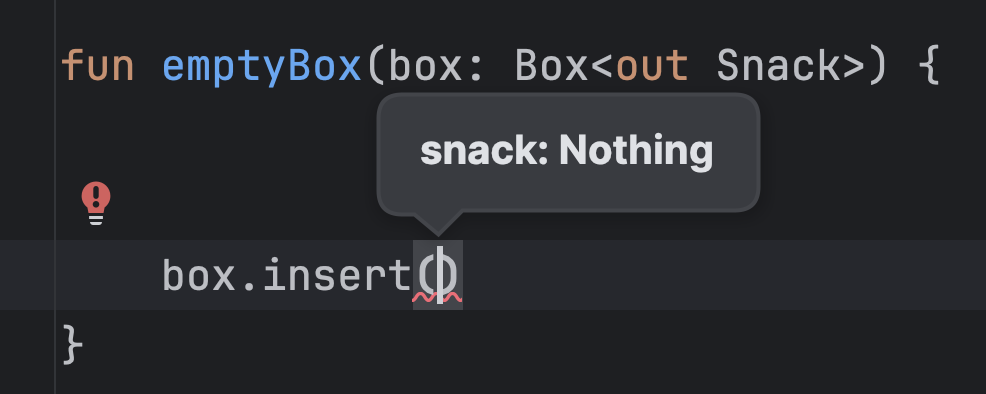
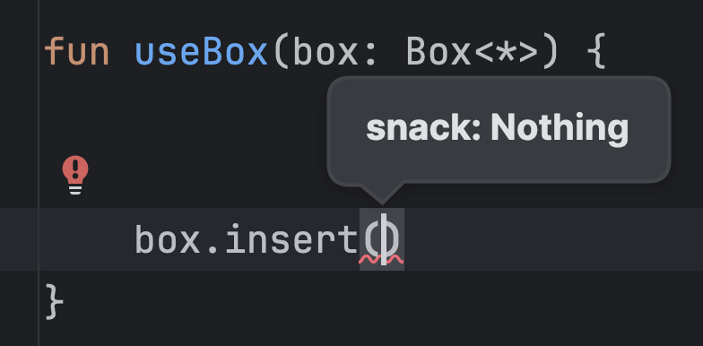

# Chapter 10: Generics - Extras

> This _Extras_ page provides additional detail for the [main chapter](./10.md). The material here is optional to study. Read it at your own leisure, it will not be part of the test.

Chapter 10 covered the basics of [variance](./10.md#variance). In these extras, you'll learn more about some of the more exciting ways of using variance in Kotlin.

### Use-site variance

What you've seen so far was *declaration-site variance*. The variance of the generic type parameter is specified at the declaration of the class that it belongs to, and this variance will apply to all usages of the generic class. In the example above, this means that every `Dispenser` will be covariant, and every `Collector` will be contravariant on its type parameter.

For invariant types, such as `Box` or `MutableList`, we might still want to occasionally have some variance on their type parameters, when a specific use case allows it.

Let's say we want to empty a `Box` with a function like this:

```kotlin
fun emptyBox(box: Box<Snack>) {
    while (true) {
        val snack: Snack = box.take() ?: break
        println("Removed $snack")
    }
}
```

As we've seen before, we can't pass a `Box<Pretzel>` into this function. While it always outputs `Snack` instances, meaning our current usage would be safe, its `insert` function can't accept any kind of `Snack` instance, which would make using it as a `Box<Snack>` potentially unsafe.

We've seen that we can introduce new interfaces that will include just a part of the functionality of the `Box` type, but that's quite a bit of extra work, and it depends on the author of `Box` to set up those interfaces in advance. What if we could simply promise the compiler that we won't insert snacks into the `Box` instance, just for this specific function?

This is exactly what use-site variance allows us to do: specify variance for a single use of a type which is otherwise invariant. To achieve covariance on the use-site, we can use `out` keyword:

```kotlin
fun emptyBox(box: Box<out Snack>) {
    while (true) {
        val snack: Snack = box.take() ?: break
        println("Removed $snack")
    }
}

val pretzelBox: Box<Pretzel> = ...
emptyBox(pretzelBox) // ✅
```

This allows us to safely use any method where the type parameter is in an *out* position.

What ensures that we won't insert just any `Snack` into this box? It turns out that wherever the type parameter is used in an *in* position, it's changed to the `Nothing` type when you add use-site covariance:



This prevents us from calling this method altogether, which is the price to pay for the covariance. The compiler effectively removed this method from the interface by making it impossible to call.

---

You can also add contravariance after-the-fact with use-site variance. Let's write a function that inserts a `Pretzel` in a `Box<Pretzel>`, like this:

```kotlin
fun insertPretzel(box: Box<Pretzel>) {
    box.insert(Pretzel())
}
```

Again, this function can't be called with a `Box<Snack>`, as we might grab a snack from the box while expecting to receive a `Pretzel` specifically. But we can add use-site variance to get contravariance, and enable our limited use case of only putting snacks into the box:

```kotlin
fun insertPretzel(box: Box<in Pretzel>) {
    box.insert(Pretzel())
}

val snackBox: Box<Snack> = ...
insertPretzel(snackBox)
```

Methods where the type parameter appears in *in* positions are safe to use in this case, but what about the ones where it's in the *out* position? You can still call them, but it won't be guaranteed that you'll get a `Pretzel` out of them. Instead, the type parameter in these positions is replaced by `Any?`:


This means that with use-site contravariance, all functions remain callable on the object that the original type had. For this to be safe, you lose some typing when using methods that have the type parameter in the *out* position.

The special, restricted types that you get when using use-site variance are called *projected types*, and the mechanism creating them is *type projection*. For a nice visual recap of variance and projections, [take a look at this article](https://typealias.com/guides/ins-and-outs-of-generic-variance/).

### Star projections

You may also want to refer to a `Box` in your code while completely ignoring what its type arguments are. This would be useful, for example, if the type had functionality that doesn't rely on its generic parameters (for example, a `count()` method that returns an `Int`).

The language feature that gives you a type with no specific type argument is a *star projection*, and it looks like this: `Box<*>`.

```kotlin
fun useBox(box: Box<*>) {
    // Use non-generic functionality of the box
}
```

All `Box` types are a subtype of `Box<*>`, regardless of their type argument:

```kotlin
useBox(snackBox) // Box<Snack>
useBox(pretzelBox) // Box<Pretzel>
```

Using this projected type comes with serious restrictions: since you don't know the type parameter of the `Box` instance you're handling, you can't use the type parameter in either *in* or *out* positions.

The restriction for *in* positions will be a familiar one: the type parameter is replaced with `Nothing` whenever it's in an *in* position, making the method impossible to call:



Interestingly, the type parameters in the *out* position don't simply get replaced with `Any?` in this case. This projection is a bit smarter than the one that deals with contravariance, and it knows that since there's a constraint on the type parameter of `Box` (`T : Snack`) it can at most be as broad as that constraint, so it deducts `Snack?` as the return type for `take`.


For even more about star projections, and neat illustrations, [read this article](https://typealias.com/guides/star-projections-and-how-they-work/).

## Sources

- [Star-Projections and How They Work](https://typealias.com/guides/star-projections-and-how-they-work/)
