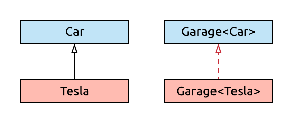
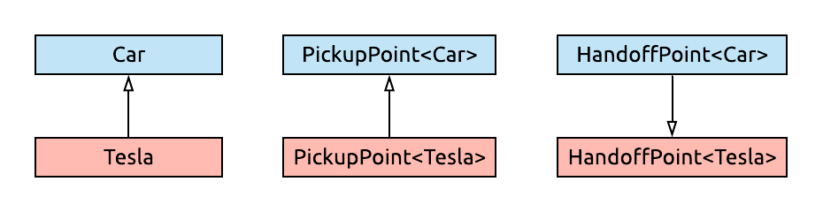
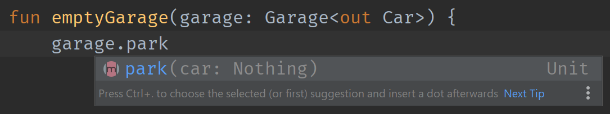
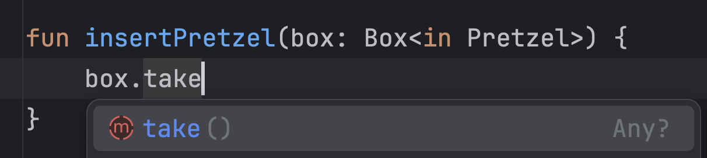
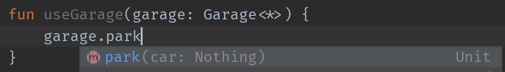
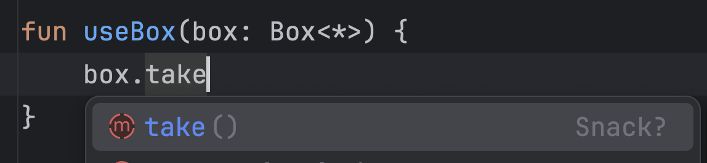

# Chapter 10: Generics

Generics are a powerful means of code reuse, and are widely utilized in both Java and Kotlin. We've touched on generics before, but haven't discussed their intricacies yet. In this chapter, we'll recap why we need them, and then see how Kotlin's type system makes it safe to work with them.

## The reason for Generics

Imagine for a moment that we don't have a list collection provided to us by the JDK or the Kotlin Standard Library, and have to implement our own. Without generics, we'd have two choices:

- Implement a list type for each type of object that we want to store in lists. For example, a `StringList` class would take a `String` as the parameter of its `add` method, and return a `String` from its `get` method. This is convenient and safe to use, but whenever we want to create a list of a new type, we have to implement a new list class that can store that specific type.

    ```kotlin
    class StringList {
        fun add(string: String) { ... }
        fun get(index: Int): String { ... }
    }
    
    val stringList = StringList()
    stringList.add("testing")
    val test: String = stringList.get(0)
    ```

- Create a single `List` type that stores a `List` of `Any` (or `Object`) instances, which solves the issue of having to create new types all the time. However, we now have to remember that we stored, say, `String` instances in a given list, then remember to only put `String` instances in it, and finally cast them back to `String` when we read them from the list, so that we can actually use them.

    ```kotlin
    class List {
        fun add(t: Any) { ... }
        fun get(index: Int): Any { ... }
    }
    
    val stringList = List()
    stringList.add("testing") // remember, Strings only!
    val test: String = stringList.get(0) as String // hope it's a String
    ```

It probably doesn't need further explanation that both of these approaches are remarkably inconvenient and error-prone.

With generics, we can create a `List<T>` class, which uses the generic *type parameter* `T` in its implementation, such as for the parameter of `add` and the return type of `get`. Then, if we instantiate a `List<String>`, the type parameter is fulfilled by the concrete *type argument* `String`, and we'll only be able to add `String` instances to our list, and get any objects out of it with the `String` type as well. Safe and convenient!

```kotlin
class List<T> {
    fun add(t: T) { ... }
    fun get(index: Int): T { ... }
}

val stringList = List<String>()
stringList.add("testing")
val test: String = stringList.get(0)
```

> Under the hood, on the JVM, we're essentially performing the second scenario described out above - but the compiler is helping us out with a lot of the type checking and casting.

Similarly to generic classes, we can create generic functions, by adding type parameters to them. These allow us to, for example, define a `forEach` function that can work on a `List<T>`, regardless of what the actual `T` type is:

```kotlin
inline fun <T> List<T>.forEach(actions: (T) -> Unit) {
    for (element in this) actions(element)
}
```

The `T` type parameter is declared right after the `fun` keyword. Calling this on a `List<Person>` will substitute the type parameter with `Person` thanks to type inference, and give us a parameter of the `Person` type in our lambda:

```kotlin
people.forEach { person: Person ->
    println(person.name)
}
```

It's also possible to explicitly pass a type parameter to a function, if it can't be inferred from context, for example a function like this:

```kotlin
fun <T> create(): T { /* create an instance of T somehow... */ }

create<Person>()
```

> Type parameters are usually single letters in Kotlin. If you look into the Standard Library, you'll see plenty of `T`, `R`, and `C`. These are great if they're being used in relatively standard ways (`T` being whatever single generic parameter, `R` a return type parameter, `C` a collection of some kind), but they can get confusing otherwise. Don't be afraid to use generic type names such as `Item` or `Element` if it makes your code easier to read.

### Upper bounds

You can specify upper bounds for generic type parameters, if you have requirements for the type arguments. For example, you might want to create a function that accepts numbers, prints them as a `Double`, and then returns them with their original type:

```kotlin
fun <N : Number> printNumber(number: N): N {
    println(number.toDouble())
    return number
}

val l: Long = printNumber(23L)
```

One upper bound that you might want to use a lot is, surprisingly, `Any`. If you don't specify an upper bound for your functions, the default will actually be `Any?`, which allows any nullable type to be substituted as well! 

```kotlin
fun <T> testEquality(t1: T, t2: T): Boolean {
    return t1.equals(t2) 
          // ^ e: Only safe (?.) or non-null asserted (!!.) calls 
          //      are allowed on a nullable receiver of type T
}
```

Using `Any` as an upper bound will only allow subtypes of `Any`, which are all non-nullable types.

```kotlin
fun <T : Any> testEquality(t1: T, t2: T): Boolean {
    return t1.equals(t2)
}
```

> Note that specifying a type parameter such as `T : Any` still lets you use the `T?` type, if you need to.

By default, you can specify a single constraint on a type parameter when you declare it. But what if we needed, for example, a type parameter that implements both of these interfaces?

```kotlin
interface Writer {
    fun write(str: String)
}

interface Reader {
    fun read(): String
}
```

If you need multiple upper bounds, you can specify them at the very end of the function signature, with the `where` keyword:

```kotlin
fun <T> readWriteStuff(t: T)
        where T : Reader, T : Writer {
    val str = t.read()
    t.write(str)
}
```

While the language doesn't support intersection types (a type that's defined as having to be a subtype of multiple types), these kinds of combined constraints can give you type parameters which can behave a lot like a intersection type. 

### The usefulness of `Unit`

`Unit` being a proper type comes in handy with generics - let's say we have a `Task<T>` type like this:

```kotlin
interface Task<T> {
    fun execute(): T
}
```

If we need an instance that returns no result when it's done, in Java we couldn't express that as `Task<void>`, because `void` is not a type, just a keyword which signifies the special case of functions that don't return a result. Instead, we'd use the [`Void`](https://docs.oracle.com/javase/8/docs/api/java/lang/Void.html) type, which is the typesystem-equivalent of `void`, to create a `Task<Void>`.

In Kotlin, we can use the same `Unit` in both of these places to describe the lack of meaningful data, so we'd end up with simply `Task<Unit>`.

### Variance

The interaction of generics and inheritance is a very interesting one. For simple types, we know that they can be used wherever their supertypes are expected. What about generic types?

Let's create a `Garage` type representing a parking garage, which lets you park and then retrieve a generic type of `Car`:

```kotlin
interface Garage<T : Car> {
    fun park(car: T)
    fun take(): T?
}
```

The million-dollar question, then: given that a `Tesla` is a `Car`, does it follow that a `Garage<Tesla>` is a `Garage<Car>`?

#### Covariance

Let's see if we can use a `Garage<Tesla>` where a `Garage<Car>` is expected. We'll create a function that takes a `Garage<Car>` as a parameter, and uses its functionality. It first empties the entire garage, and then parks a new `Car` in it.
  
```kotlin
fun testGarage(garage: Garage<Car>) {
    // Empty the garage
    while (true) {
        val car: Car = garage.take() ?: break
        println("Removed $car")
    }
    // Park a new car
    garage.park(Car())
}
```

> Yes, `break` is also an expression, and its return type is `Nothing`. Handy!

Now, let's call it with a `Garage<Tesla>` as its parameter:

```kotlin
val teslaGarage = object : Garage<Tesla> {
    override fun take(): Tesla { ... }
    override fun park(car: Tesla) { ... }
}

testGarage(teslaGarage)
```

We get an error on the call to `testGarage`:

```
Type mismatch.
Required: Garage<Car>
Found: Garage<Tesla>
```

So why are we not allowed to pass in this parameter? Whenever `take()` is called, our `Garage<Tesla>` will return a `Tesla?`, which is a `Car?`. This is all sound. However, then we can also attempt to park a `Car()` (or `Fiat()`, or any other `Car` instance) in a `Garage<Car>`, which we can't do with a `Garage<Tesla>` that only accepts `Tesla` instances. *This means that a `Garage<Tesla>` is not a `Garage<Car>`.*



We've seen that a `Garage<Tesla>` worked fine in the place of a `Garage<Car>` in certain ways, and not others. It was fine as long as we only took generic values *out* of it. If we just remove the problematic method that takes values of `T` as a parameter, our `Garage<Tesla>` would be safe to use as a `Garage<Car>`.

We'll define an interface that only allows picking cars up:

```kotlin
interface PickupPoint<out T : Car> {
    fun take(): T?
}
```

Note how we've marked the `T` type parameter with the `out` keyword. This keyword ensures that the generic type parameter is only used in *out* positions, i.e. as the return type of functions or properties. If we used `T` for a function's parameter inside this interface, in an *in* position, we'd get a compilation error. In exchange for this restriction, the compiler now knows that a `PickupPoint<Tesla>` can function as a `PickupPoint<Car>`:

```kotlin
fun testPickup(pickupPoint: PickupPoint<Car>) {
    // Take a car from the pickup point
    val car: Car = requireNotNull(pickupPoint.take())
    println("Driving a $car")
}

val teslaPickup = object: PickupPoint<Tesla> {
    override fun take(): Tesla? { ... }
}
testPickup(teslaPickup) // All good!
```

This behavior, marked by the `out` keyword, is called *covariance*. A generic type `Generic` is covariant on a type parameter, when `X` being a subtype of `Y` means that a `Generic<X>` will be a subtype of a `Generic<Y>`. The **subtyping direction is the same** for the parameters and the generic types that use them. They vary *together*, they are *co*variant.


#### Contravariance

What about handing off cars to a `Garage`? We've seen that a `Garage<Tesla>` can't work as a `Garage<Car>` for these purposes, because a `Garage<Car>` has to accept any kind of `Car`. However, we can spot an inverse relationship here: a `Garage<Car>` could work as a `Garage<Tesla>` in this case, as it can accept `Tesla` instances!

Of course it won't be true that `Garage<Car>` is a subtype of `Garage<Tesla>`. When we want to pick up a `Tesla`, we can't get one from a `Garage<Car>` in a type safe manner, because it might contain other types of cars, and give us one of those. The same problem as before - we have to split this functionality into a one-way interface too:

```kotlin
interface HandoffPoint<in T : Car> {
    fun park(car: T)
}
```

This time, the type parameter is marked with the `in` keyword, which restricts us to using it in *in* positions, only as the types of values that the interface receives as a parameter. This tells the compiler that an instance of a `HandoffPoint` may have a more general type argument than what's required.

Case in point, it makes our `HandoffPoint<Car>` work as a `HandoffPoint<Tesla>`, just like we wanted it to:

```kotlin
fun testHandoff(handoff: HandoffPoint<Tesla>) {
    handoff.park(Tesla())
}

val carHandoff = object : HandoffPoint<Car> {
    override fun park(car: Car) { ... }
}
testHandoff(carHandoff) // OK!
```

This behavior, marked by the `in` keyword, is called *contravariance*. A generic type `Generic` is covariant on a type parameter, when `X` being a subtype of `Y` means that a `Generic<Y>` will be a subtype of a `Generic<X>`. The **subtyping direction is reversed** between the type arguments and the generic types that use them. They vary in the *opposite* direction, they are *contra*variant.



#### Invariance

With these new interfaces in place, we can quickly reintroduce the `Garage` type, as the combination of these two interfaces:

```kotlin
interface Garage<T : Car> : PickupPoint<T>, HandoffPoint<T>
```

The type parameter of `Garage` can neither be covariant nor contravariant, as it uses the `T` type parameter in both *in* and *out* positions. A type like this is an *invariant* type.


> We've seen that reading values from a type with a generic type parameter enables covariance. This is another benefit of having separate [`List`](https://kotlinlang.org/api/latest/jvm/stdlib/kotlin.collections/-list/) and [`MutableList`](https://kotlinlang.org/api/latest/jvm/stdlib/kotlin.collections/-mutable-list/) interfaces in the Standard Library. While the `MutableList` interface is doomed to be invariant, `List` is actually covariant. A `List<Tesla>` is automatically  a `List<Car>`, which makes using lists a lot smoother!

> There are first-party types that use this exact same approach of splitting a bidirectional interface into two interfaces for variance. [`Channel`](https://kotlin.github.io/kotlinx.coroutines/kotlinx-coroutines-core/kotlinx.coroutines.channels/-channel/index.html) is a good example of this, as it combines the [`SendChannel`](https://kotlin.github.io/kotlinx.coroutines/kotlinx-coroutines-core/kotlinx.coroutines.channels/-send-channel/) and [`ReceiveChannel`](https://kotlin.github.io/kotlinx.coroutines/kotlinx-coroutines-core/kotlinx.coroutines.channels/-receive-channel/) interfaces, which are contravariant and covariant, respectively.

#### Use-site variance

What you've seen above is *declaration-site variance*. The variance of the generic type parameter is specified at the declaration of the class that it belongs to, and this variance will apply to all usages of the generic class. In the example above, this means that every `PickupPoint` will be covariant, and every `HandoffPoint` will be contravariant on its type parameter.

For invariant types, such as `Garage` or `MutableList`, we might still want to occasionally have some variance on their type parameters, when our specific use case allows it.

Let's say we want to empty a `Garage` with a function like this:

```kotlin
fun emptyGarage(garage: Garage<Car>) {
    while (true) {
        val car: Car = garage.take() ?: break
        println("Removed $car")
    }
}
```

As we've seen before, we can't pass a `Garage<Tesla>` into this function. While it always outputs `Car` instances, meaning our current usage would be safe, it can't accept any kind of `Car` instance in its `park` function, which would make using it as a `Garage<Car>` potentially unsafe.

We've seen that we can introduce new interfaces that will include just a part of the functionality of the `Garage` type, but that's quite a bit of extra work. What if we could simply promise the compiler that we won't use the `Garage` instance to park cars inside this specific function?

This is exactly what use-site variance allows us to do. Specify variance for a single use of a type which is otherwise invariant. To achieve covariance on the use-site, we can use `out` keyword:

```kotlin
fun emptyGarage(garage: Garage<out Car>) {
    while (true) {
        val car: Car = garage.take() ?: break
        println("Removed $car")
    }
}

val teslaGarage: Garage<Tesla> = ...
emptyGarage(teslaGarage)
```

This allows us to safely use any method where the type parameter is in an *out* position.

What ensures that we won't park just any `Car` into this garage? It turns out that wherever the type parameter is used in an *in* position, it's changed to the `Nothing` type when you employ use-site covariance:



This prevents us from calling this method altogether, which is the price to pay for the covariance. The compiler effectively removed this method from the interface, by making it uncallable.

---

You can also add contravariance after-the-fact with use-site variance. Let's write a function that parks a `Tesla` in a `Garage<Tesla>`, like this:

```kotlin
fun parkTesla(garage: Garage<Tesla>) {
    garage.park(Tesla())
}
```

Again, this function can't be called with a `Garage<Car>`, as we might take a car from the garage inside the function while expecting to receive a `Tesla` specifically. But we can add use-site variance to get contravariance, and enable our limited use case of only placing cars in the garage:

```kotlin
fun parkTesla(garage: Garage<in Tesla>) {
    garage.park(Tesla())
}

val garage: Garage<Car> = ...
parkTesla(garage)
```

Methods where the type parameter appears in *in* positions are safe to use in this case, but what about the ones where it's in the *out* position? You can still call them, but it won't be guaranteed that you'll get a `Tesla` out of them. Instead, the type parameter in these positions is replaced by `Any?`:



This means that with use-site contravariance, all functions remain callable on the object that the original type had. For this to be safe, you lose some typing when using methods that have the type parameter in the *out* position.

The special, restricted types that you get when using use-site variance are called *projected types*, and the mechanism creating them is *type projection*. For a nice visual recap of variance and projections, [take a look at this article](https://typealias.com/guides/ins-and-outs-of-generic-variance/).

#### Star projections

You may want to refer to a `Garage` in your code, regardless of what its type arguments are. This would be useful, for example, if the type contained some methods that don't rely on its generic parameters (for example, a `count()` method that simply returns an `Int`).

The language feature that gives you a type with no specific type argument is a *star projection*, and it looks like this: `Garage<*>`.

```kotlin
fun useGarage(garage: Garage<*>) {
    // Use non-generic functions?
}
```

All `Garage` types are a subtype of `Garage<*>`, regardless of their type argument.

```kotlin
useGarage(garage) // Garage<Car>
useGarage(teslaGarage) // Garage<Tesla>
```

Using this projected type will have to come with serious restrictions: since you don't know the type parameter of the `Garage` instance you're handling, you can't use the type parameter in neither *in* nor *out* positions.

The restriction for *in* positions will be a familiar one: the type parameter is replaced with `Nothing` whenever it's in an *in* position, making the method impossible to call:



Interestingly, the type parameters in the *out* position don't simply get replaced with `Any?` in this case. This projection is a bit smarter than the one that deals with contravariance, and it knows that since there's a constraint on the type parameter of `Garage` (`T : Car`) it can at most be as broad as that constraint, so it deducts `Car?` as the return type for `take`.



For even more about star projections, and neat illustrations, [read this article](https://typealias.com/guides/star-projections-and-how-they-work/).

#### The usefulness of `Nothing` in generics

Generics and variance also gives us an opportunity to use `Nothing` again. It's a common pattern to define a sealed class that can either hold a generic result, or wrap an error, like this:

```kotlin
sealed class Result<T : Any>
class Success<T : Any>(val result: T) : Result<T>()
class Error<T : Any>(val throwable: Throwable) : Result<T>()
```

> Note how the result `T` type can never be nullable here.

If we want to report an error for a call that expects a `Result` like this, we can do it by creating an `Error` instance:

```kotlin
fun getData(): Result<String> {
    return Error<String>(RuntimeException("oh bother"))
}
```

The way that this `Error` class works is interesting. It defines a generic type parameter that it doesn't use - or rather, uses only to conform to its supertype. This class doesn't actually have to be generic to inherit from `Result`. It doesn't use its generic parameter in any way, and there's no reason why the same `Error` containing an exception couldn't be a `Result` that asked for a `String` and a `Result` that asked for a `Customer` at the same time. We can express this like so, thanks to `Nothing` being a bottom type:

```kotlin
sealed class Result<T : Any>
class Success<T : Any>(val result: T) : Result<T>()
class Error(val throwable: Throwable) : Result<Nothing>()
```

If we haven't realized that we needed variance on this class so far, we'd definitely realize it now, as a `Result<Nothing>` at this point is not a `Result<String>` or a `Result<Customer>`, so we can't use `Error` in the way that we wanted to use it.

Similarly, code like this doesn't work either, because a `Result<Employee>` is not a `Result<Person>`:

```kotlin
open class Person
class Employee : Person()

fun getPerson() : Result<Person> {
    return Success<Employee>(Employee())
}
```

The issue in both of these cases is that `Result` is invariant (the default behaviour for a generic parameter, if not specified otherwise), so only exact type arguments can be used. This can be fixed by adding covariance to our `Result` class, using the `out` keyword:

```kotlin
sealed class Result<out T : Any>
class Success<T : Any>(val result: T) : Result<T>()
class Error(val throwable: Throwable) : Result<Nothing>()
```

> Sealed classes for results of operations like this one are used frequently in Kotlin, as a way to avoid having to handle exceptions with `try-catch` blocks. Instead, methods using these result types can always return normally, and their results can be checked for success or failure using a `when` statement.

> Since Kotlin 1.5, the Standard Library contains a [`Result`](https://kotlinlang.org/api/latest/jvm/stdlib/kotlin/-result/) type that's quite similar to the one we've implemented here.

### Reified generics

In Java, whenever we use generics, we have to deal with a "feature" of the JVM called [*type erasure*](https://docs.oracle.com/javase/tutorial/java/generics/erasure.html). To oversimplify it: generic types only exist at compile time, and all generic parameters are replaced with the `Object` type by the time they end up in the bytecode. This differs for example from the C++ implementation of generics, where separate, typed classes get generated for every type parameter that a generic class is used with. (These approaches are the second and first of the painful manual options laid out [in the introduction at the beginning of this chapter](#the-reason-for-generics), respectively).

This type erasure is the reason why we have trouble with...

- Telling apart a `List<Kitten>` and a `List<Tiger>` at runtime by performing `instanceof` checks on a `List` instance

    ```java
    if (list instanceof List<Kitten>) {
        print("Aww.")    // ^ Error: Illegal generic type for instanceof
    } else if (list instanceof List<Tiger>) {
        print("Uh-oh.")         // ^ Error: Illegal generic type for instanceof  
    }
    ```

- Getting the `.class` of a type parameter like we'd do with a regular type

    ```java
    System.out.println(String.class); // This works
    System.out.println(T.class);     
                     // ^ Error: Cannot select from a type variable
    ```
 
- Performing type checks against a type parameter
    
    ```java
    System.out.println("" instanceof String); // This works
    System.out.println("" instanceof T);
                                  // ^ Error: Class or array expected
    ```

So what are reified generics, and how do they help us with these issues in Kotlin? They are, essentially, a clever compile time trick. When we create a generic function in Kotlin, we can mark its type parameters as `reified` - but only if we also make the function itself `inline`. For example:

```kotlin
inline fun <reified T> printType(t: T) {
    println("I think '$t' is ${T::class}")
}
```

Accessing the generic parameter's `class` wouldn't normally be possible on the JVM, however, if we call this function with the reified parameter, it works:

```kotlin
printType("hi")  // I think 'hi' is class kotlin.String
printType(Bar()) // I think 'Bar' is class foo.Bar
```

How is this possible? Remember, we can only make type parameters reified if our function is inlined - and that's exactly where the magic happens. When we call an inline function, its body is essentially copied to the call site instead of a function call being performed.

When this happens for a function that has a reified type parameter, all usages of that type parameter in the body get replaced with the concrete type argument that the function was invoked with at the call site. This is the same process that happens to regular parameters during inlining, just applied to type parameters this time.

For example, our previous two calls above compile to these lines (at the bytecode level), with the concrete values of the type parameters inlined:

```kotlin
println("I think '${"hi"}' is ${String::class}")
println("I think '${Bar()}' is ${Bar::class}")
```

... which are perfectly valid calls to perform on these concrete types.

This handy transformation also lets us perform type checks such as `x is T` if `T` is reified. For example, this generic function can be easily implemented in Kotlin:

```kotlin
inline fun <reified R> List<*>.filterType(): List<R> {
    val result = mutableListOf<R>()
    for (element in this) {
        if (element is R) {
            result.add(element)
        }
    }
    return result
}
```

It's an extension on a `List` with an unknown (or any) type argument, takes a reified type parameter, and filters the original list to only those elements that are of the type `R`. Its usage would look like this:

```kotlin
val list = listOf(1, 'o', 992.5233, 2, 25.21, "foo", 17)
println(list.filterType<Double>()) // [992.5233, 25.21]
```

When we invoke this `filterType` function with the `Double` type argument, the type check inside it becomes an `element is Double` check at compile time, which is perfectly valid bytecode.

> This function is actually called [`filterIsInstance`](https://kotlinlang.org/api/latest/jvm/stdlib/kotlin.collections/filter-is-instance.html), and it's part of the Kotlin Standard Library.

# Summary
 
Kotlin has powerful support for advanced generics, with the help of type constraints, variance, and projections. You don't even really have to keep track of how these things interact in your code - the compiler pays attention to all of this for you, and ensures that you're only performing safe operations.

`Nothing` can be a useful type when defining generic class hierarchies. Reified generic type parameters let you access the values of type arguments at runtime.
 
 # Sources
 
 - Illustrated articles on generics by Dave Leeds
     - [An Illustrated Guide to Covariance and Contravariance in Kotlin](https://typealias.com/guides/illustrated-guide-covariance-contravariance/)
     - [The Ins and Outs of Generic Variance in Kotlin](https://typealias.com/guides/ins-and-outs-of-generic-variance/)
     - [Star-Projections and How They Work](https://typealias.com/guides/star-projections-and-how-they-work/)
 - Official documentation
     - [Generics: in, out, where](https://kotlinlang.org/docs/reference/generics.html)
