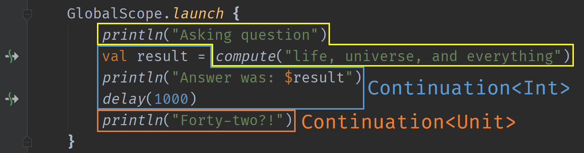

# Chapter 11: Coroutines - Extras

### Under the hood of a suspending function

Let's take a brief look at coroutines under the hood, to see how the suspension mechanism works. We'll use this piece of code for this:

```kotlin
suspend fun compute(question: String): Int {
    delay(236_682_000_000_000_000L) // ~ 7.5 million years
    return 42
}

fun demoCoroutines() {
    GlobalScope.launch {
        println("Asking question")
        val result = compute("life, universe, and everything")
        println("Answer was: $result")
        delay(1000)
        println("Forty-two?!")
    }
}
```

Every call to a suspending function creates a *suspension point* in your function. These suspension points slice your functions up into various pieces, each of which executes in a regular, boring, blocking way. For our `demoCoroutines` function with its two suspension points, this means three distinct parts:



The first, yellow block executes together, as a series of blocking instructions. When it calls into `compute` though, the magic happens. It doesn't just pass in the `String` parameter that's visible here at the call site: it also passes in a *continuation*.

Here's what (a slightly skewed projection of) the interface of the `Continuation` type looks like:

```kotlin
public interface Continuation<in T> {
    public val context: CoroutineContext
    public fun resume(value: T)
    public fun resumeWithException(exception: Throwable)
}
```

This `Continuation` represents the remaining part of our coroutine after a suspension point, and it's how we can get back to our coroutine after a suspension completes. Its generic type argument is whatever type the suspending function call returns to the next piece of the coroutine. If we manage to produce this value inside the suspending function, `resume` will be called, and if we failed with an exception, `resumeWithException` is called instead.

All of this is invisible to us at the source level, but if we get a good enough decompiler (and unfortunately, the built-in one is not able to handle coroutines too well), we can see it happening at the bytecode level:

```java
@Nullable
public static final void compute(
    @NotNull final String question,
    @NotNull final Continuation<Integer> $completion) {
     // lots of code pertaining to delay, which would be yet another 
     // suspending call and an additional level of nesting...
     $completion.resume(42)
}
```

> This is *not* the real bytecode produced by coroutine code, it is vastly simplified here to avoid some of the complicated details.

Every time we suspend, we pass in the next piece of code to be executed after the asynchronous call is completed as a parameter. This type of programming is called [*continuation-passing style*](https://en.wikipedia.org/wiki/Continuation-passing_style), as opposed to the *direct style* that we're used to with synchronous code.

But doesn't this look awfully familiar? We've managed to make our way back to using callbacks! However, we are much better off than before. Instead of writing these callbacks ourselves, and having to think in this style at the source level, the compiler is performing this transformation for us!

The actual implementation of coroutines also involves some generated classes to hold state, as well as a state machine that keeps track of which suspension point a given coroutine is at in a function. We won't dive any deeper into this here, but you can find more resources on this in the sources below.

### Wrapping a callback

There are many existing libraries that use callback-based APIs. These would normally force all your code to operate in a callback-based manner, but they can be integrated nicely with coroutines by converting calls to these APIs into suspending calls instead, using extension functions.

Take a callback-based API like this one:

```java
public abstract class Task<T> {
    public interface OnCompleteListener<T> {
        void onComplete(T result);
        void onError(Throwable exception);
    }

    protected OnCompleteListener<T> listener;

    public void setListener(OnCompleteListener<T> listener) {
        this.listener = listener;
    }
}
```

Methods called in a library that contains this `Task` type can shoot off asynchronous calls on background threads, and return a `Task` as their result. It's your task to attach a listener to this task, so that you're notified of its completion:

```kotlin
getUsername().setListener(object : Task.OnCompleteListener<String?> {
    override fun onComplete(result: String?) {
        println("Success: $result")
    }

    override fun onError(exception: Throwable?) {
        println("Error: $exception")
    }
})
```

This `setListener` call returns immediately, and the callbacks inside it will be invoked at a later time. We would rather suspend at this point, so that we can keep writing sequential code that should run after this asynchronous waiting for a result has completed.

We can extend the `Task` type with an extension function that is named `await` by tradition:

```kotlin
suspend fun <T> Task<T>.await(): T = suspendCoroutine { cont ->
    this.setListener(object : Task.OnCompleteListener<T> {
        override fun onComplete(result: T) {
            cont.resume(result)
        }

        override fun onError(exception: Throwable) {
            cont.resumeWithException(exception)
        }
    })
}
```

This suspending function uses the [`suspendCoroutine`](https://kotlinlang.org/api/latest/jvm/stdlib/kotlin.coroutines/suspend-coroutine.html) function to - guess what - suspend the currently running coroutine. We have a suspension point!

The lambda passed to `suspendCoroutine` receives a [`Continuation`](https://kotlinlang.org/api/latest/jvm/stdlib/kotlin.coroutines/-continuation/index.html) as its parameter, and we can manually use this `Continuation` to either resume the coroutine at the suspension point by producing a result, or by throwing an exception at the suspension point by providing a `Throwable`. We simply hook these two calls up with the appropriate callbacks in our `Task` API, and we're good to go!

```kotlin
suspend fun main() {
    val name = getUsername().await()
    println(name)
}
```

We can now get a `Task` from the API and simply `await` it in a suspending way. Awesome!

> [`suspendCancellableCoroutine`](https://kotlin.github.io/kotlinx.coroutines/kotlinx-coroutines-core/kotlinx.coroutines/suspend-cancellable-coroutine.html) from `kotlinx-coroutines` is an even nicer way of doing this, with handling of coroutine cancellation.

> This pattern used to be the way to integrate Retrofit calls with coroutine-based applications, and Firebase APIs are also a [prime example](https://joebirch.co/2019/10/03/using-firebase-on-android-with-kotlin-coroutines/) where this can come in handy during Android development.

