# Chapter 11: Coroutines

Kotlin's coroutines are a language feature that enable powerful asynchronous programming. They're a "simple", low-level construct, that various kinds of asynchronous abstractions and APIs can be built upon. In this chapter, we'll get familiar with the practical basics of coroutines, and see how they can make our unavoidably asynchronous lives easier.

## Foundations

Threading, parallelism, concurrency... We'll come across a lot of similar-sounding concepts while exploring coroutines. Let's start by defining some of these.

#### Threading

All of our code executes on threads. By default, when writing a JVM console application, it creates just a single thread, which executes the `main()` function for us (and any functions called from there).


We can also create own threads manually, if we want to get off of the main one. Then we can place code on them in the form of a `Runnable` (conveniently represented by a lambda in Kotlin), and run them, join them, interrupt them, ~~boil 'em, mash 'em, stick 'em in a stew~~ as we please.

```kotlin
val thread = Thread {
    println("Printing from this thread!")
}
thread.name = "my-background-thread"
thread.start()
thread.join()
```


Threads are expensive to create and they are tedious to manage with this direct API, so we have the abstraction of an [`Executor`](https://docs.oracle.com/javase/8/docs/api/java/util/concurrent/Executor.html) (and the further abstraction of [`ExecutorService`](https://docs.oracle.com/javase/8/docs/api/java/util/concurrent/ExecutorService.html)) from the JDK, which makes dealing with threads easier.

```java
public interface Executor {
    void execute(Runnable command);
}
```

`Executor`s can wrap a single thread or multiple ones (a threadpool) and *reuse* those for whatever tasks we throw at them in the form of `Runnable` instances, with neat scheduling, cancellation options, and so on. This is much cheaper than creating new threads all the time, for anything we want to do in the background.

```kotlin
val singleThreadExecutor: Executor = Executors.newSingleThreadExecutor()
val threadpoolExecutor: Executor = Executors.newFixedThreadPool(8)

singleThreadExecutor.execute {
    println("I'm in a Runnable!")
}
```

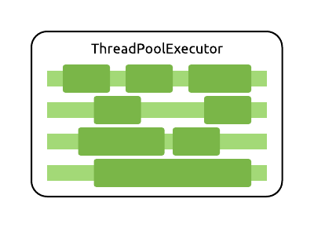

Why is going to background threads beneficial? One thing we might seek by doing this is improved performance, thanks to parallelism, which we'll get to in just a moment.

In other cases, it can also be a hard requirement. When we write GUI applications (be it Android, JavaFX, or Swing for example), the frameworks responsible for the GUI usually dedicate a single *main* or *UI* thread to processing input events and drawing the interface elements. If we block this thread with long-running code, our users will see our app freeze, which is a terrible experience!

#### Parallelism

Starting new threads and placing work on `Executor`s like above lets us perform things in **parallel**. Multiple computations or IO operations can be in progress at the exact same time, which can reduce the total time that executing our program takes. For example, we can calculate the results of two complicated formulas at the same time, or process filters on two images on two separate threads.


The alternative to parallel execution would be what we get by default when using a single thread: **sequential** execution. One task executed after another. Execution of our lines of code one by one, in order.


Note that sequential doesn't always mean single-threaded. You can still perform a sequential series of tasks while continuously hopping threads (in fact we'll do quite a bit of this later on!):


Of course, not every task can or should be parallelized: for small tasks, the overhead of creating new threads and coordinating work between them will result in worse performance than just single-threaded sequential processing. Parallel code is also a lot harder to reason about than sequential code, as [race conditions](https://en.wikipedia.org/wiki/Race_condition#Software) may occur.

#### Concurrency

**Concurrency** is the idea of executing two tasks *virtually* at the same time. This can happen by true parallelism, on two different threads executing simultaneously on a multicore CPU:


However, it can also be done using just a single thread and core in a time-sliced manner:


Both of these approaches achieve concurrency. To the outside world, it will seem like these two tasks have been performed "at the same time". This means that any concurrent code, even if it's not parallel, is subject to the perils of race conditions.

> Threads and scheduling are a very complex topic to discuss as we have CPU-level multithreading within a single core, upon which OS threads run, upon which JVM threads are created, etc. Slicing, optimizations, and virtualization happens at several levels here. We are using simplified, good-enough definitions here.

#### Asynchronicity

Two quick and relatively simple definitions to wrap up the introduction.

When you execute something **synchronously**, you must wait for it to finish before moving on to another task. This is what happens with regular, blocking function calls.

> This would be making a sandwich for ourselves for dinner, performing all the required steps, participating in the process all along, without doing anything else while it's happening.

When you execute something **asynchronously**, you can move on to another task before it finishes, and then deal with the result later. This is what happens when you use callback-based APIs.

> This is making popcorn in the microwave. We start it, then for a while we are free to perform other tasks, and then we're eventually notified of completion by the beeping in the kitchen.

## Our asynchronous sample app

Enough definitions, let's see all of this in code! Our example app will be a JavaFX application, which allows us to search for TV shows using the [TVmaze API](https://www.tvmaze.com/api).

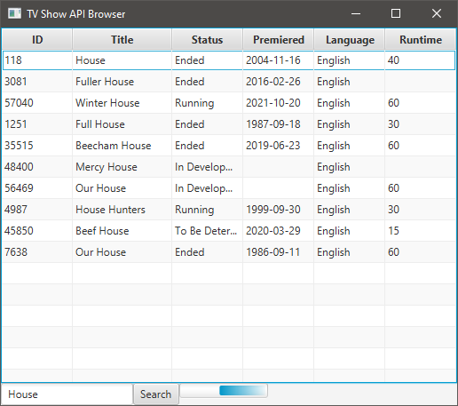

We'll focus on the part of the application that fetches the show information from the network. This is done using two models:

```kotlin
data class ShowSummary(
    val id: Int,
    val name: String,
)

data class ShowDetails(
    val id: Int,
    val name: String,
    val status: String,
    val runtime: Int?,
    val premiered: String?,
    val language: String?,
)
```

### Blocking behaviour

... and an initial, blocking API with the following interface:

```kotlin
interface BlockingApi {
    fun search(query: String): List<ShowSummary>
    fun getDetails(id: Int): ShowDetails
}
```

First, we'll perform a search for the keyword that was input in the text box. This will yield a list of `ShowSummary` objects, which only contain IDs and titles, so we'll then call the details API for each of these IDs to figure out the status, runtime, premiere date, and more - this is the information contained in the `ShowDetails` model.

Here's this in code, using our API:

```kotlin
fun getShowDetailsBlocking(query: String, tableView: TableView<ShowDetails>) {
    val api: BlockingApi = BlockingApiImpl()

    val showSummaries = api.search(query) // blocking network call
    val details = showSummaries.map { summary ->
        api.getDetails(summary.id) // blocking network calls
    }

    tableView.setData(details)
}
```

> The TVmaze API actually returns all the data we need in the first fetch. We're not parsing it on purpose so that we have to make additional network calls for the detailed descriptions. This is only for educational purposes!

This takes *1+N* network calls - *N* being the number of results - which takes a bit of time. All these calls are executed on a single thread, sequentially, and synchronously. As our `map` call is looping through the summaries, it waits for each of their details to be fetched over the network before going for the next item.

This means that we are blocking the UI thread of the application while we're performing all these calls! If you try to interact with the application - sort a column, resize or move the window - while the search is happening, you'll see that it's unresponsive.


### Asynchronous callbacks

Let's get off the UI thread with our network calls with a simple solution: callbacks.

Instead of having our API's functions block the caller's thread until it can return the results, they'll take a callback function as their parameter, and return immediately. The actual network calls are started in a background thread, and the provided callback function will be invoked back on the main thread when the results are ready, *asynchronously*. In the meantime, the main thread will be free to do other things, for example, process UI events.

Our callback-based API will have this interface:

```kotlin
interface CallbackApi {
    fun search(query: String, callback: (List<ShowSummary>) -> Unit)
    fun getDetails(id: Int, callback: (ShowDetails) -> Unit)
}
```

Let's take a look at how this may be implemented, on top of the original blocking API:

```kotlin
override fun search(query: String, callback: (List<ShowSummary>) -> Unit) {
    Thread {
        val result = blockingApi.search(query)
        Platform.runLater {
            callback(result)
        }
    }.start()
}
```

The function starts a new background `Thread` immediately, which it blocks for the duration of the network call, and then it gets back to the main thread to invoke the `callback`.

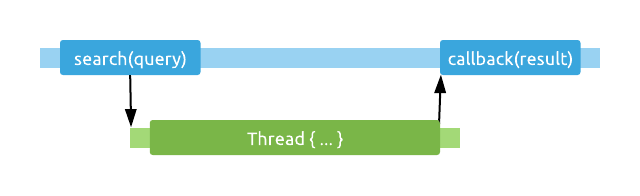

This is done by using [`Platform.runLater`](https://docs.oracle.com/javase/8/javafx/api/javafx/application/Platform.html#runLater-java.lang.Runnable-), which puts the `Runnable` it receives as a parameter on the event queue that the JavaFX application's main thread processes events from. This is the same queue that user input events will end up in! Whenever the main thread is not busy, it will look at this queue for events to process. It will eventually run our `Runnable`, invoking the callback that we'll use to update the table with the results.

> Other platforms with a GUI, such as Android, also have dedicated UI threads and various mechanisms to dispatch runnable pieces of code to that thread (e.g. [`runOnUiThread`](https://developer.android.com/reference/android/app/Activity.html#runOnUiThread(java.lang.Runnable))).

Starting a new `Thread` for every call into our API implementation is quite wasteful. This could be improved by using a single `ExecutorService` internally, backed by a threadpool of a couple of threads.

> Grab the [chapter project](../projects/chapters/chapter-11) and making this improvement to the `CallbackApiImpl` class yourself!

Moving to this callback-based API will force us to change the way we write our code at the call site. The functions we call don't return results to us directly anymore. They return immediately (with `Unit`), and we have to place the code we want to run after they've produced a result in the callbacks.

Since we need to make a second round of network calls based on the results of the first one, we'll also have to nest our callbacks:

```kotlin
fun getShowDetailsWithCallbacks(query: String, tableView: TableView<ShowDetails>) {
    val callbackApi: CallbackApi = CallbackApiImpl()

    val results = mutableListOf<ShowDetails>()
    callbackApi.search(query) { showSummaries ->
        for (show in showSummaries) {
            callbackApi.getDetails(show.id) { showDetails ->
                results.add(showDetails)

                if (results.size == showSummaries.size) {
                    tableView.setData(results)
                }
            }
        }
    }
}
```

Note that since `getDetails` is now asynchronous and returns immediately (not waiting for its network call to complete), our behaviour has changed significantly here. The `for` loop fires off all requests for show details in parallel (each in their own thread), whereas earlier we were making these calls sequentially.

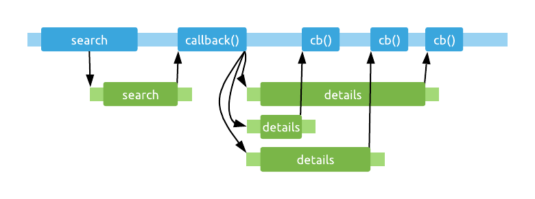

This will actually give us better load times, as network requests are generally slow operations, and are worth executing in parallel. However, it also comes with plenty of complications - as concurrent code was promised to.

Our callbacks will be invoked in an unknown order, which means that it's no longer simple to tell when they're all done, so that we can use their results. To know when we've received the last callback, we are placing each details object in a `MutableList` as it's loaded, and whenever there are as many items in the list as we expect it to have for the final result, we figure that we're done and set the data in the `TableView`.

This has some issues:

- The results in this list are in essentially random order, as our network calls might have taken varying amounts of time, and the callbacks could've run in any order. If the order of these items was important, we'd have to somehow keep track of this (or sort them after they're all loaded).
- We are modifying a mutable data structure from multiple threads, which might lead to consistency issues (or, if we're lucky, exceptions).
- We should've prepared for some of these calls failing, which can happen easily when making network requests. If any of the calls fail and they don't invoke their callback, we'll never reach the desired list size in the callbacks, despite getting *some* amount of results from the network. This means that our UI will never be updated.

Fixing these kinds of things using callbacks is very, very painful. Even if these all worked magically, callbacks twisted our code inside out. Instead of writing code from top to bottom, we are forced to continuously nest callbacks into each other as our asynchronous steps progress, in a lovely structure often referred to as callback hell (see [here](http://callbackhell.com/), [here](https://stackoverflow.com/a/25098230/4465208), and especially [**here**](https://journal.stuffwithstuff.com/2015/02/01/what-color-is-your-function/)).

### Futures, Promises, and Rx

There are higher-level abstractions that operate asynchronously, which can flatten sequential asynchronous calls by chaining function calls together. For example, the same code using a [`CompletableFuture`](https://docs.oracle.com/javase/8/docs/api/java/util/concurrent/CompletableFuture.html)-based API might look something like this (with a bit of help from [Java Streams](https://docs.oracle.com/javase/8/docs/api/java/util/stream/package-summary.html) to fire off a list of futures at the same time):

```kotlin
futureApi.search(query)
    .thenApply { summaries ->
        val futures = summaries.map { futureApi.getDetails(it.id) }
        Stream.of(*futures.toTypedArray())
            .map(CompletableFuture<ShowDetails>::join)
            .collect(Collectors.toList())
    }
    .thenAccept { results: List<ShowDetails> ->
        Platform.runLater {
            tableView.setData(results)
        }
    }
```

Or using the ever-popular [RxJava](https://github.com/ReactiveX/RxJava) library, you could do something like this:

```kotlin
rxApi.search(query)
    .flatMapObservable { showSummaries ->
        Observable.fromIterable(showSummaries)
    }
    .flatMapSingle { rxApi.getDetails(it.id) }
    .toList()
    .subscribeOn(Schedulers.io())
    .observeOn(JavaFxScheduler.platform())
    .subscribe { results: List<ShowDetails> ->
        tableView.setData(results)
    }
```

These solutions both avoid the issues of callbacks to some degree. They prevent endless nesting by turning the same sequential behaviour into chained calls. They are also able to keep the order of the items while grabbing the details, and even give you reasonable error handling functionality (not present in the code snippets above).

However, they come with their own downsides. `CompletableFuture` has a fairly small API, and you'll have to combine them with additional tools such as [`Stream`](https://docs.oracle.com/javase/8/docs/api/java/util/stream/Stream.html) to combine them just the way you need them.

RxJava is likely to have an operator for everything you'll ever need, you just have to know about them and figure out how to combine them. This is also its drawback, it has [*all of the operators*](http://reactivex.io/documentation/operators.html). You have to learn these and get used to them.

Both of these APIs solve some of our problems - they give us multithreaded, asynchronous calls, with error handling - but they require us to shape our code differently from the traditional, imperative, synchronous style that we write blocking code in, and are used to.

> This familiarity is useful: it helps us spot mistakes in the code, as we already know how certain patterns behave.

Their APIs are also not what we're used to with synchronous code. Instead of returning the actual types that they are "returning", they return wrappers that will eventually produce these types somehow. In the case of the Rx example, all return values are wrapped in `Single`s:

```kotlin
interface RxApi {
    fun search(query: String): Single<List<ShowSummary>>
    fun getDetails(id: Int): Single<ShowDetails>
}
```

Now, with all of this behind us, let's see how coroutines can make dealing with all of these issues simpler.

## Coroutine basics

Coroutines are "suspendable computations". They can execute code asynchronously, and they can be used to easily move work to background threads. 

Coroutines used to be advertised as *lightweight threads*, which gets the basic idea across well enough, but we'll see that coroutines are much more capable (and indeed, much more lightweight) than threads.

Once again, we'll use our original blocking API, this time as the basis for the coroutine implementation of fetching shows. We'll start our first coroutine by using `GlobalScope.launch`. This [`launch`](https://kotlinlang.org/api/kotlinx.coroutines/kotlinx-coroutines-core/kotlinx.coroutines/launch.html) function returns immediately, and the lambda passed to it will be executed on a background thread - in a coroutine:

```kotlin
val api: BlockingApi = BlockingApiImpl()

GlobalScope.launch {
    // start of the coroutine
    val showSummaries = api.search(query)
    val details = showSummaries.map {  summary ->
        api.getDetails(summary.id)
    }
    tableView.setData(details)
    // end of the coroutine
}
```

What happens here is conceptually very similar to just starting a `Thread` manually, like this:

```kotlin
Thread {
    val showSummaries = api.search(query)
    val details = showSummaries.map {  summary ->
        api.getDetails(summary.id)
    }
    tableView.setData(details)
}.start()
```

This is a good start, but our coroutine runs the entire code we've passed to `launch` in a background thread, so there's still the issue of getting back to the main thread to call `setData`. It's time to talk about how we can control which thread a coroutine runs on.

### Contexts

Taking a look at the simplified signature of the `launch` function, we can see that it takes a `CoroutineContext` as an optional parameter.

```kotlin
fun launch(
    context: CoroutineContext = EmptyCoroutineContext,
    block: suspend () -> Unit
): Job
```

> We'll ignore the `GlobalScope` part of our coroutine starting code for now for simplicity, but we'll get back to it later!

So what's a context then? It's a set of *elements* that describe *how* a coroutine is executed. These elements can control various aspects of a coroutine:

- Threading
- Cancellation
- Error handling
- A name for debugging
- And more!

A `CoroutineContext` may contain a value for any number of these elements (including none, such as in the default `EmptyCoroutineContext` value). You can think of these as slots inside the context that may be filled or left empty:

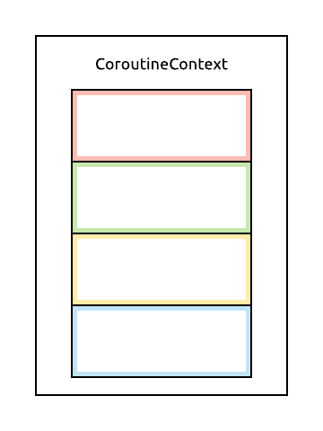

Each of these elements may be used as a `CoroutineContext` on their own, in that case, they form a context with only a single element.

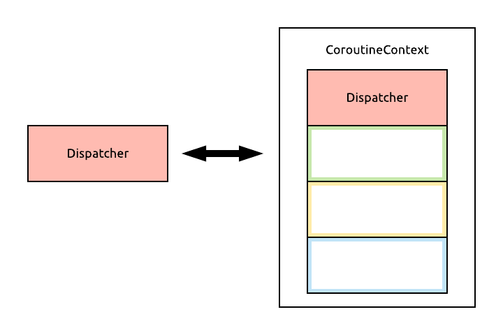

Contexts can also be combined easily using the `+` operator. If two contexts that contain the same kind of element are combined, the element on the right-hand side of the operator will be the one that makes it into the result context.

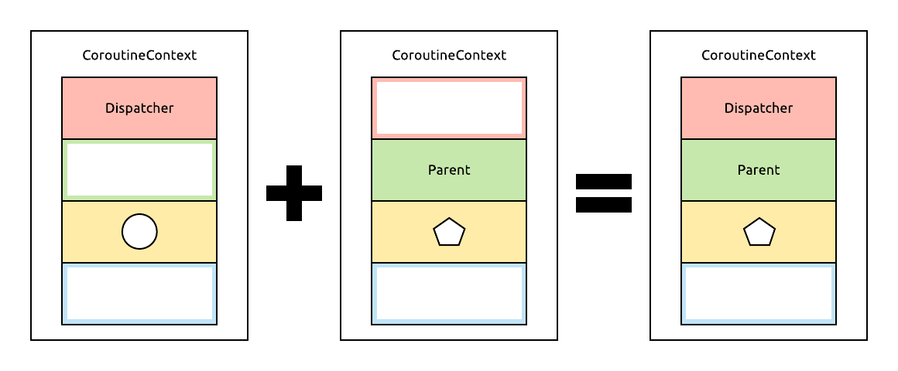

The threading aspect of coroutines is handled by [`CoroutineDispatcher`](https://kotlin.github.io/kotlinx.coroutines/kotlinx-coroutines-core/kotlinx.coroutines/-coroutine-dispatcher/) instances. The `kotlinx.coroutines` library includes a few dispatcher implementations that cover most common use cases, which are found nested in the [`Dispatchers`](https://kotlin.github.io/kotlinx.coroutines/kotlinx-coroutines-core/kotlinx.coroutines/-dispatchers/index.html) object:

- [`Default`](https://kotlin.github.io/kotlinx.coroutines/kotlinx-coroutines-core/kotlinx.coroutines/-dispatchers/-default.html)
  - Used by default for new coroutines if no other dispatcher is specified. It's meant to be used for CPU-heavy computational tasks. This dispatcher wraps as many threads as your CPU has (but at least two, to avoid simple deadlock problems). Thanks to matching the number of threads to CPU cores, running lots of coroutines using this dispatcher can comfortably saturate all CPU cores.
- [`IO`](https://kotlin.github.io/kotlinx.coroutines/kotlinx-coroutines-core/kotlinx.coroutines/-dispatchers/-i-o.html)
  - This dispatcher also wraps a threadpool, and is meant to be used for IO-intensive work (for example, disk and network interactions), which block threads, but don't require CPU-heavy computation. It uses 64 threads for this purpose (or the number of cores the CPU has, if that happens to be more).
- [`Main`](https://kotlin.github.io/kotlinx.coroutines/kotlinx-coroutines-core/kotlinx.coroutines/-dispatchers/-main.html)
  - This dispatcher is only available if there is a GUI framework being used, and it wraps the main thread of the application in a platform-specific way. To access this dispatcher, additional dependencies (e.g. [`kotlinx-coroutines-javafx`](https://github.com/Kotlin/kotlinx.coroutines/tree/master/ui/kotlinx-coroutines-javafx)) have to be included in the project.
- [`Unconfined`](https://kotlin.github.io/kotlinx.coroutines/kotlinx-coroutines-core/kotlinx.coroutines/-dispatchers/-unconfined.html)
  - A special dispatcher which doesn't prescribe any specific thread for the coroutine, and simply executes on the thread that it was started from (with some caveats, see its documentation for more precise details).

To use one of these dispatchers, we can pass them in as the parameter of the `launch` function, and the coroutine it starts will execute on that dispatcher. We'll also be able to change the dispatcher a coroutine is running on while it's executing.

> Fun fact: the `IO` and `Default` dispatchers share threads between their threadpools, which means that switching between these two dispatchers in a running coroutine might be entirely free, as it can just keep using the same thread!

These are just the built-in dispatchers, but you may also create your very own, should you need to do something very specific for threading. For example, you might want to have a Dispatcher wrapping a single background thread, and move all of your database operations to that Dispatcher with coroutines. The easiest way to create your own Dispatcher is to convert an `Executor` into one:

```kotlin
val dispatcher: CoroutineDispatcher = 
        Executors.newSingleThreadExecutor().asCoroutineDispatcher()
```

> If you simply need a dispatcher that confines how many parallel coroutines you have running on it, you can use [`limitedParallelism`](https://kotlin.github.io/kotlinx.coroutines/kotlinx-coroutines-core/kotlinx.coroutines/-coroutine-dispatcher/limited-parallelism.html) on an existing dispatcher (such as `Dispatchers.Default` or `Dispatchers.IO`) to avoid creating new threads.

### Contexts in practice

With our newfound knowledge of coroutine dispatchers, let's launch our coroutine performing network calls in the correct context:

```kotlin
GlobalScope.launch(Dispatchers.IO) {
    val showSummaries = api.search(query)
    val details = showSummaries.map { summary ->
        api.getDetails(summary.id)
    }
    tableView.setData(details)
}
```

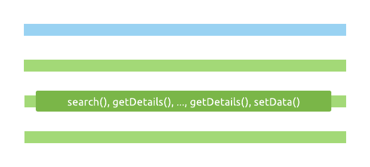

Blocking network calls now happen on a thread provided by `Dispatchers.IO`, yay! However, we still didn't make it back to the UI thread for our `tableView` update. For this, we'll use the [`withContext`](https://kotlin.github.io/kotlinx.coroutines/kotlinx-coroutines-core/kotlinx.coroutines/with-context.html) function. This higher-order function takes a lambda that it will execute sequentially inside our coroutine, but will do so in a different context - the one given to the function as a parameter.

Since a `CoroutineContext`, among other things, defines the thread the coroutine executes on, we can use this to move a part of our coroutine to the main thread, with `Dispatchers.Main`:

```kotlin
GlobalScope.launch(Dispatchers.IO) {
    val showSummaries = api.search(query)
    val details = showSummaries.map { summary ->
        api.getDetails(summary.id)
    }
    withContext(Dispatchers.Main) {
        tableView.setData(details)
    }
    println("Back in the background!")
}
```

This gets back to the initial definition of coroutines: they are, at their core, *suspendable computations*, which is powered by a mechanism called suspension. Everything else, like their ability to run asynchronously or to change threads is a result of suspension.

The `withContext` function is a *suspending* function. When it's called, it suspends execution of the coroutine on the IO thread that it was started on, *freeing up that thread for other coroutines to use*.

Then, it executes the code passed to it in the specified context, in this case, on the main thread. When it's done, `withContext` returns, and our coroutine will get back into the context of the IO Dispatcher, and continue from the point where it left off before suspending, executing the rest of the code in it after the `withContext` call. In this example, this is the dummy call to `println`.

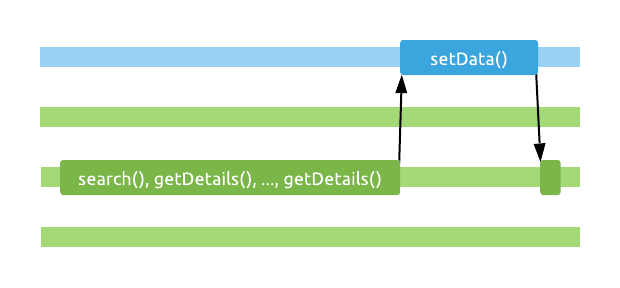

> Note that the coroutine gets back into the context of `Dispatchers.IO` after `withContext` returns, but this doesn't mean that it'll be on the same thread as before. It can end up on any thread used by this Dispatcher.

It's more conventional to turn this thread handling inside out - start the coroutine in the context of the UI thread and have its contents execute there by default. Any costly blocking calls can then be moved to background threads by switching contexts:

```kotlin
GlobalScope.launch(Dispatchers.Main) {
    val showSummaries = withContext(Dispatchers.IO) {
        api.search(query)
    }
    val details = showSummaries.map { summary ->
        withContext(Dispatchers.IO) {
            api.getDetails(summary.id)
        }
    }

    tableView.setData(details)
}
```

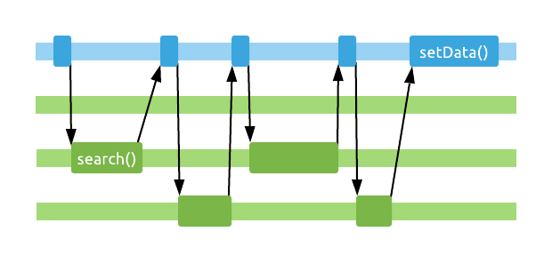

Notice how `withContext` actually returns the result of the part of the coroutine that executes inside it, which is used above in both cases. This is possible, as the function that calls it is suspended while it executes, and waits for this result.

It's also worth noting that we can use `withContext` inside complex structures, such as inside the lambda passed to the `map` function! Now the main thread will be suspended mid-loop whenever we perform a `getDetails` call.

Making these context changes here in the UI handling code with `withContext` is a bit unsightly, and if we forget to wrap these calls, we'll accidentally block the UI thread. Thankfully, we can create our own *suspending functions*, which will have the same ability as `withContext` - they'll be able to execute without blocking the caller thread!

This is done by using the `suspend` keyword on our functions. Yes, we'll now `suspend fun`. Sorry!

We'll create a `CoroutineApi` interface like this:

```kotlin
interface CoroutineApi {
    suspend fun search(query: String): List<ShowSummary>
    suspend fun getDetails(id: Int): ShowDetails
}
```

There are no callbacks involved, and the methods directly return the result when they're called instead of wrapping them in a `Future`-like type.

However, they'll be able to do this in a non-blocking way, by suspending. Their implementation is actually rather simple too: we'll use `withContext` inside them to switch from whatever thread the methods were called on to the IO dispatcher!

```kotlin
class CoroutineApiImpl : CoroutineApi {
    private val blockingApi: BlockingApi = BlockingApiImpl()

    override suspend fun search(query: String): List<ShowSummary> {
        return withContext(Dispatchers.IO) {
            blockingApi.search(query)
        }
    }

    override suspend fun getDetails(id: Int): ShowDetails {
        return withContext(Dispatchers.IO) {
            blockingApi.getDetails(id)
        }
    }
}
```

The call site at this point simplifies to something very familiar and simple looking:

```kotlin
val api: CoroutineApi = CoroutineApiImpl()

GlobalScope.launch(Dispatchers.Main) {
    val showSummaries = api.search(query) // suspends!
    val details = showSummaries.map { summary ->
        api.getDetails(summary.id) // suspends!
    }
    tableView.setData(details)
}
```

Apart from having to start the coroutine, the rest of our code looks the same as its blocking, synchronous counterpart that we started out with at the very beginning. Unlike with callbacks, futures, or reactive frameworks, coroutines don't make you learn a new style of programming, and don't change the shape of your code. You can still make function calls, assign their results to variables, and quite importantly, use constructs like basic loops or the collection functions you've already learned - without having to learn new, coroutine-specific APIs for these tasks.

> Of course, you do need to learn coroutine-specific APIs to work with them, but not for managing basic control flow with coroutines.

What's done with comments above, noting *suspension points*, is marked by the IDE with gutter icons:

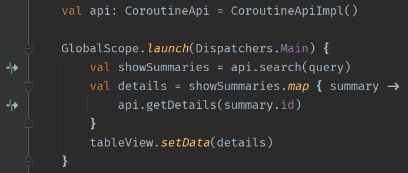

The `suspend` keyword and its accompanying mechanism is actually the only support provided for coroutines by the language. All other constructs that we're using here (`launch`, `withContext`, and so on) come from the `kotlinx.coroutines` library, which is a first-party library built on top of the suspension mechanism. The expectation is that only library authors will ever have to interact with the coroutine APIs on the lowest levels, and everyone else writing application code will rely on `kotlinx.coroutines` and similar libraries (like we just did!), which offer higher-level abstractions.

### Suspension doesn't happen magically

It's important to note that marking a function with the `suspend` keyword doesn't make it suspend execution on the caller thread automatically, it just makes it possible for the function to suspend. For example, a function like this is still not safe to call from the main thread, as it performs a heavy computation that will freeze the UI:

```kotlin
suspend fun findBigPrime(): BigInteger = BigInteger.probablePrime(4096, Random())
```

A well-behaving suspending function is expected to suspend on the caller thread, and perform its work somewhere else (in other words, it's expected to be [main-safe](https://developer.android.com/kotlin/coroutines/coroutines-best-practices#main-safe)). This might be done by using `withContext`, which is a very commonly used solution, but there are other mechanisms available that can be used to suspend a coroutine. We can either use these ourselves, or call into a library that provides a suspending API that will perform the required suspension work internally.

In our simple example, we can use `withContext`:

```kotlin
suspend fun findBigPrime(): BigInteger = withContext(Distpatchers.Default) {
    BigInteger.probablePrime(4096, Random()))
}
```

### Under the hood of a suspending function

You can learn more about how coroutine suspension works in the [extras of this chapter](./11-extras.md#under-the-hood-of-a-suspending-function). Spoiler: it's callbacks all the way down!

### Starting coroutines

Suspending functions have an important rule: they can only be called from other suspending functions. A regular function has no notion of suspending execution, so they'd have no way of waiting for a suspending call to return its result.

> Other than by blocking the thread, which would certainly defeat the point.

This presents a small riddle: how do we make our first call to a suspending function, if we need to already be in a suspending function to do so? This is the purpose that *coroutine builders* serve. They let us bridge the gap between the regular, blocking, synchronous world and the suspenseful world of coroutines.

We've already used the [`launch`](https://kotlin.github.io/kotlinx.coroutines/kotlinx-coroutines-core/kotlinx.coroutines/launch.html) coroutine builder to create a new coroutine. The "trick" to `launch` is that it takes a lambda parameter, which is a suspending function:

```kotlin
fun launch(
    context: CoroutineContext = EmptyCoroutineContext,
    block: suspend () -> Unit
): Job
```

Internally, it creates a new coroutine, which executes the suspending `block` of code passed to it. `launch` is a "fire-and-forget" style coroutine builder, as it doesn't return a result. The `launch` function returns immediately after starting the coroutine, while that new coroutine fires off asynchronously.

`launch` does return a [`Job`](https://kotlinlang.org/api/kotlinx.coroutines/kotlinx-coroutines-core/kotlinx.coroutines/-job/) instance, which, according to the documentation:

> is a cancellable thing with a life-cycle that culminates in its completion.

This `Job` represents a piece of work being performed by a coroutine, and it can be used to keep track of that coroutine. For example, we can check if it's still running, or cancel it:

```kotlin
val job = GlobalScope.launch {
    println("Job is running...")
    delay(500)
    println("Job is done!")
}

Thread.sleep(200L)
if (job.isActive) {
    job.cancel()
}
```

> [`delay`](https://kotlin.github.io/kotlinx.coroutines/kotlinx-coroutines-core/kotlinx.coroutines/delay.html) is a handy suspending function that we can use inside coroutines to wait for a given amount of the time in a non-blocking way.

Since the coroutine above is cancelled before the `delay` is over, only its first print statement will be executed:

```
Job is running...
```

We can also `join` a `Job` (wait until it completes), similarly how we can join a `Thread`. This doesn't happen in a blocking way, however. The `join` method on `Job` is suspending, and will suspend until that `Job` completes. This means that we can only use it if we're inside a coroutine, for example:

```kotlin
fun main() {
    val job = GlobalScope.launch {
        println("Job is running...")
        delay(500)
        println("Job is done!")
    }

    GlobalScope.launch {
        println("Second coroutine started, will wait for first")
        job.join()
        println("All done!")
    }

    Thread.sleep(1000)
}
```

This will print the following:

```
Job is running...
Second coroutine started, will wait for first
Job is done!
All done!
```

### Explicit parallelism

We already know `launch`, our simple, fire-and-forget coroutine builder. We can also switch threads back and forth by using `withContext` and passing in various dispatchers. However, all of our coroutine code so far has been sequential. At each suspension point, the coroutine waited for the suspending call to return, and then continued from there.

Let's use this dummy function in the upcoming snippets to load some data, with a bit of a delay, in a suspending way.

```kotlin
suspend fun getData(index: Int): Double {
    delay(1000L)
    return index * 2.0
}
```

If we want to load two pieces of data with this function using `launch`, this will take us two seconds, as we only start loading the second piece of data once we have the first one:

```kotlin
GlobalScope.launch {
    val result = getData(1) + getData(2) 
    println("Result is $result")
}
```

This is even clearer if we format this code this way:

```kotlin
GlobalScope.launch {
    val data1 = getData(1) // Loads for 1 second
    val data2 = getData(2) // Loads for 1 second again
    val result = data1 + data2
    println("Result is $result")
}
```

This sequential-by-default behaviour of coroutines is actually very handy. As discussed in the introduction, it's much easier to reason about sequential code than concurrent code.

Coroutines do also support parallelism, but they require us to be explicit about it. The second coroutine builder we'll learn is the one that lets us run coroutines in parallel: [`async`](https://kotlin.github.io/kotlinx.coroutines/kotlinx-coroutines-core/kotlinx.coroutines/async.html).

When we call `async`, we pass it a suspending function as its parameter, just like we did with `launch`. However, `async` is not fire-and-forget: it will produce a value when it's done. The value is represented by the [`Deferred`](https://kotlin.github.io/kotlinx.coroutines/kotlinx-coroutines-core/kotlinx.coroutines/-deferred/index.html) object that's returned from the `async` call (immediately, after it fires off the coroutine). This is a coroutine-powered, non-blocking *future*/*promise* type.

If we create two coroutines with `async` that each call `getData`, they'll start executing in parallel immediately:

```kotlin
val data1: Deferred<Double> = GlobalScope.async { 
    getData(1) 
}
val data2: Deferred<Double> = GlobalScope.async { 
    getData(2) 
}
```

To get the results of these coroutines, we'll have to use the [`await`](https://kotlin.github.io/kotlinx.coroutines/kotlinx-coroutines-core/kotlinx.coroutines/-deferred/await.html) function on `Deferred`. Hello, *async-await*. `await` is another non-blocking, suspending function, which means that we have to call it inside a coroutine. Let's just start a third coroutine for now, which will `await` both results, and then print their sum:

```kotlin
val data1 = GlobalScope.async { getData(1) }
val data2 = GlobalScope.async { getData(2) }

GlobalScope.launch {
    val result = data1.await() + data2.await()
    println("Result is $result")
}
```

This last coroutine here has two suspension points, one at each `await` call. Unlike before, however, these `await` calls aren't what start the data fetches - by the time we get to these, those are already happening in the first two coroutines which are running.

These `await` calls only serve to suspend until each `Deferred` can produce a result, and they will return as soon as the async coroutines that are behind the `Deferred` instances complete. Since these run in parallel, the first `await` call will take about a second to return, but the second `await` call will return almost immediately.

In total, this code will execute in roughly one second, instead of the two that it would've taken sequentially.

### Cancellation

Let's talk about cancellation next, which will get us to a second `CoroutineContext` element, as well as one of the most crucial concepts around coroutines.

```kotlin
val job = GlobalScope.launch {
    println("Job is running...")
    delay(500)
    println("Job is done!")
}

Thread.sleep(200L)
if (job.isActive) {
    job.cancel()
}
```

We've seen that code like this works as expected, and only the first message in the coroutine is printed:

```
Job is running...
```

This happens because we call `cancel` while the suspending `delay` call is happening in the coroutine. At this point, a [`CancellationException`](https://kotlinlang.org/api/kotlinx.coroutines/kotlinx-coroutines-core/kotlinx.coroutines/-cancellation-exception/) is thrown, which ensures that the rest of the coroutine's code is not executed. 

What if there were no suspension points in the coroutine, and its entire body was just blocking code? For example, if we replace the `delay` call with [`Thread.sleep`](https://docs.oracle.com/javase/8/docs/api/java/lang/Thread.html#sleep-long-):

```kotlin
val job = GlobalScope.launch {
    println("Job is running...")
    Thread.sleep(500L)
    println("Job is done!")
}

Thread.sleep(200L)
if (job.isActive) {
    job.cancel()
}
```

If we run the code again, we'll see this output:

```
Job is running...
Job is done!
```

We're in trouble, cancellation is now broken! It turns out that coroutines can only be cancelled *cooperatively*. While a coroutine is running blocking code, it won't be notified of being cancelled.

#### Cooperating with cancellation

Why doesn't the `Thread` that the coroutine is running on get shut down forcibly? Because this would be dangerous. When you write blocking code, you expect lines of code to be executed together, one after another. If this gets cut off in the middle, your application will be left in an unpredictable state. This issue can be avoided by using a cooperative approach, which is what coroutines do.

The points of the coroutine where cancellation can happen are called *cancellation points*. These are usually (but not always) suspension points. The easiest way to cooperate with cancellation is to call functions from `kotlinx.coroutines` that support cancellation (include cancellation points) already.

Using `delay` is an example of this. If a coroutine is cancelled while waiting for a `delay`, it will throw a `CancellationException` instead of returning normally. If our coroutine was cancelled some time *before* a call to `delay`, and this cancellation wasn't handled yet, `delay` will also throw this exception as soon as it's called.

> Watch out! Calling `delay(0)` will *not* introduce a cancellation point in your code, as the `delay` function is optimized to simply return immediately when called with `0` as parameter, without suspending or checking for cancellation.

How else can we cooperate? Let's say that we have a list of entities to save to two different places which we perform by calling these two blocking functions:

```kotlin
fun saveToServer(entity: String): Unit = ...
fun saveToDisk(entity: String): Unit = ...
```

We don't want to end up in a situation where we've saved an entity to one of these places, but not the other. We either want both of these calls to run for an entity, or neither of them.

A first approach to this problem would be to just block a thread on the IO dispatcher for the entire length of our operation, which ensures that this coroutine is practically never cancelled:

```kotlin
suspend fun processEntities(entities: List<String>) = withContext(Dispatchers.IO) {
    entities.forEach { entity ->
        saveToServer(entity)
        saveToDisk(entity)
    }
}
```

This code has no cancellation points within the body of `withContext`, so if a coroutine that called this function is cancelled, this function's body will always run its full course.

We can add cancellation support by checking if our current coroutine has been cancelled, manually. We can do this after fully processing each entity:

```kotlin
suspend fun processEntities(entities: List<String>) = withContext(Dispatchers.IO) {
    entities.forEach { entity ->
        saveToDisk(entity)
        saveToServer(entity)
        if (!isActive) {
            return@withContext
        }
    }
}
```

If our coroutine is cancelled while we run the blocking part of our code, that entire blocking part will still be executed together, but then we'll eventually notice the cancellation at the end of the loop, and stop performing further work, in a safe way.

There's also a dedicated function in kotlinx.coroutines to easily check for a cancelled coroutine: [`ensureActive`](https://kotlin.github.io/kotlinx.coroutines/kotlinx-coroutines-core/kotlinx.coroutines/ensure-active.html), which throws a `CancellationException` when it's invoked in a cancelled coroutine:

```kotlin
public fun Job.ensureActive(): Unit {
    if (!isActive) throw getCancellationException()
}
```

This means that we can call it every once in a while when performing lots of blocking work, to introduce cancellation points in our code, and provide an opportunity for the coroutine to be cancelled. This is done completely manually though, explicitly, which means we are aware of the possibility of cancellation. `ensureActive` can easily replace manual cancellation checks, if immediately terminating with an exception upon cancellation is good enough for us:

```kotlin
suspend fun processEntities(entities: List<String>) = withContext(Dispatchers.IO) {
    entities.forEach { entity ->
        saveToDisk(entity)
        saveToServer(entity)
        ensureActive()
    }
}
```

Just like with `delay`, even if the coroutine happens to have been cancelled some time before `ensureActive`, it will notice this, and throw an exception. The cancellation doesn't have to happen at the exact time that `ensureActive` is called.

Note that if there's some cleanup of the coroutine to do (freeing up resources, etc.) when it's cancelled, manual cancellation checks can still be very handy, and should be used instead of `ensureActive`.

> Another function from kotlinx.coroutines is [`yield`](https://kotlin.github.io/kotlinx.coroutines/kotlinx-coroutines-core/kotlinx.coroutines/yield.html), which has the original purpose of performing a manual suspension of the current coroutine, just to give other coroutines waiting for the same dispatcher a chance to execute. It essentially reschedules the rest of our coroutine to be executed on the same dispatcher that it's currently on. Since it's nearly a no-op, and handles cancellation (throws an exception if the coroutine it's in is cancelled), you might see it used for the same purpose as `ensureActive`.

## Structured concurrency

### Parenting coroutines

Let's take another look at this code example that loads two pieces of data in parallel and then combines them, but now with cancellation in mind.

```kotlin
val data1 = GlobalScope.async { getData(1) } // 1
val data2 = GlobalScope.async { getData(2) } // 2

GlobalScope.launch { // 3
    val result = data1.await() + data2.await()
    println("Result is $result")
}
```

Something is still not quite right with the code above. If the first coroutine started with `async` fails with an exception, the third coroutine will also receive that exception when calling `await()` on the corresponding `Deferred` object (as it can't produce a value) and crash. However, the second coroutine started with `async` will continue doing work in the background! We've only cancelled two of the three coroutines.

Though we *can* cancel coroutines manually, it's easy to see that if we had to keep track of every possible failure that can occur while running coroutines and cancel every related coroutine manually, we'd be writing *a lot* of error handling code. We'd be back to the kind of manual management that we can perform on threads.

Here's where we'll learn about a second `CoroutineContext` element: the parent `Job`. `Job` instances work in a hierarchy, and if we pass in a `Job` instance as the context of a coroutine (either on its own, or combined with other elements), it becomes the parent of the newly started coroutine's `Job`.

This hierarchy has the following effect on these jobs:

- A `Job` won't get to a completed state until all of its children have completed. A parent always waits for its children.
- If a `Job` is cancelled, it cancels all of its children before it completes its own cancellation, recursively.
- If a `Job` fails with an exception, its parent fails immediately as well, consequently cancelling all other siblings.

For a basic cancellation example, let's take a look at this code, where the second coroutine is started as the child of the first one, using the `context` parameter:

```kotlin
val job = GlobalScope.launch {
    println("This is job 1")
    delay(500)
    println("This was job 1")
}

GlobalScope.launch(context = job) {
    println("This is job 2")
    delay(500)
    println("This was job 2")
}

Thread.sleep(200L)
job.cancel()
```

Calling `cancel` on the first `Job` will also cancel its child job, resulting in only this output:

```
This is job 1
This is job 2
```

Getting back to our two `async` calls, how can we use the `Job` mechanism for cancellation there? We'd need a `Job` to serve as the parent of both `async` calls if we want them to be cancelled together. We could start an empty, dummy coroutine for this that just waits around for a while (with `launch`, for example), but there's a simpler and nicer way to do this: by creating a `Job` with its ["constructor"](https://kotlin.github.io/kotlinx.coroutines/kotlinx-coroutines-core/kotlinx.coroutines/-job.html):

```kotlin
val parent = Job()

val data1 = GlobalScope.async(context = parent) { getData(1) }
val data2 = GlobalScope.async(context = parent) { getData(2) }
GlobalScope.launch(parent) {
    val result = data1.await() + data2.await()
    println("Result is $result")
}
```

This works! If either of our three coroutines fail, they'll cancel their parent, and all the rest will be cancelled neatly.

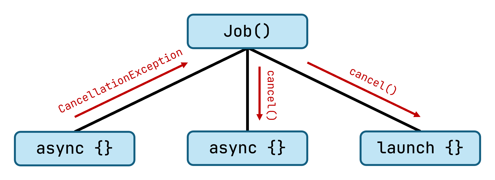

The `Job` created as the parent will never complete on its own (as it's not doing any real work), but it can be cancelled.

### The introduction of `CoroutineScope`

When working in real applications, coroutines are usually launched by a component with a lifecycle. This might be a service or a request in a server-side application, or a screen in a GUI application.

> "On a more philosophical level, you rarely launch coroutines “globally”, like you do with threads. Coroutines are always related to some local scope in your application, which is an entity with a limited life-time, like a UI element."
> - [Roman Elizarov on Structured Concurrency](https://medium.com/@elizarov/structured-concurrency-722d765aa952)

Within these components, creating a parent `Job` and then passing it to all newly created coroutines can be used to group coroutines together, so that they can all be cancelled when the component is destroyed. The issue with this approach is that specifying the parent for a coroutine is optional. If you decide not to include it (or forget to include it), your coroutines will run loose, and will never be cleaned up.

```kotlin
class Screen {
    private val parent = Job()
    
    fun performWork() {
        // Don't forget to include the parent!
        GlobalScope.launch(parent) {
            // Run async work
        }
    }
  
    fun onDestroy() {
        // Cancel the job when the component's lifecycle ends
        parent.cancel()
    }
}
```

An important step in the evolution of coroutines was the introduction of *structured concurrency*, which introduced the idea of a [`CoroutineScope`](https://kotlin.github.io/kotlinx.coroutines/kotlinx-coroutines-core/kotlinx.coroutines/-coroutine-scope/). This not only enables, but forces us to think of scoping coroutines. 

Long ago, coroutine builders like `launch` and `async` were standalone, top-level functions. With the introduction of structured concurrency, these coroutine builders became extension functions on `CoroutineScope`, which explicitly forces us to choose a scope to start each coroutine.

To avoid dealing with structured concurrency, our examples so far have used `GlobalScope`, which is just what it sounds like. It ties all coroutines in it to the entire lifetime of the application, which isn't great. Coroutines started in this scope are never cancelled automatically. Very rarely should a coroutine run in a scope this wide, so be very cautious whenever you think you need to use it.

### What's in a scope?

Let's take a look at what a `CoroutineScope` looks like at the code level:

```kotlin
public interface CoroutineScope {
    public val coroutineContext: CoroutineContext
}
```

There's not much to it! It simply contains a `CoroutineContext`, which will be used by every coroutine that's launched in this scope.

Context elements like dispatchers will be taken as-is, and placed in the context of the newly created coroutine. Jobs have special handling: each new coroutine will have its own `Job` instance created, which will have the `Job` in the scope set as its parent. This groups them neatly together, and ensures that cancelling the scope cancels all coroutines started in the scope.

> Coroutine builder functions like `launch` still take a `CoroutineContext` as an optional parameter. Passing in a context as a parameter can be used to override the elements of the context that were provided by the scope (for example, to specify a different dispatcher).

### Creating and using a scope

Instead of managing a parent `Job` like before, we can now create a `CoroutineScope` to use inside components of our application. There's a ["constructor"](https://kotlinlang.org/api/kotlinx.coroutines/kotlinx-coroutines-core/kotlinx.coroutines/-coroutine-scope.html) for this type, which takes a `CoroutineContext` as a parameter:

```kotlin
class Screen {
    private val scope: CoroutineScope = CoroutineScope(SupervisorJob() + Dispatchers.Main)
  
    fun performWork() {
        scope.launch {
            // Run async work
        }
    }
  
    fun onDestroy() {
        scope.cancel()
    }
}
```

With this scope set up, coroutines related to our component can now all be launched in the scope, and they'll be cancelled automatically when the component's lifecycle ends.

Let's take a look at the elements we've used as part of the context here:

- [`SupervisorJob`](https://kotlin.github.io/kotlinx.coroutines/kotlinx-coroutines-core/kotlinx.coroutines/-supervisor-job.html) is a special `Job` implementation, which is often useful when defining your own scope, as it doesn't get cancelled when one of its children fails. If we used a regular `Job` here, any one coroutine failing in the scope would render the entire scope unusable, as you can't create new coroutines in a scope that has already been cancelled.
- `Dispatcher.Main` is specified here to automatically start all coroutines within the component on a given dispatcher. This showcases how a scope lets us conveniently set up default configuration shared by all its coroutines.

> If you don't put a parent `Job` in a `CoroutineScope` created this way, it'll automatically create a new `Job` to serve as the parent for its coroutines. After all, the purpose of `CoroutineScope` is to provide structured concurrency.

It might be tempting to make your component implement `CoroutineScope` instead of containing one as a property, but [the officially recommended](https://github.com/Kotlin/kotlinx.coroutines/issues/1581) approach is to *contain* a scope. This makes code more explicit, and it follows the idea of composition over inheritance, as advocated by the *Effective Java* book and many others.

> Frameworks that manage components with lifecycles often provide convenient, built-in coroutine scopes for you to use. For example, the AndroidX `ViewModel` class [provides a `viewModelScope`](https://www.youtube.com/watch?v=VyBxy3_Mj6Q&t=1019s) which is automatically cancelled when the ViewModel is cleared, and the [Ktor framework](https://ktor.io/) for building server-side applications [exposes several scopes](https://youtu.be/VyBxy3_Mj6Q?t=1527) that correspond to the lifecycle of the entire application, the current request, or a websocket session.

### Building hierarchies of coroutines

Once we're inside a coroutine, for example the body of `launch`, child coroutines become easier to start, as the parameter of these builders is not only a suspending function, but an extension on `CoroutineScope`:

```kotlin
public fun CoroutineScope.launch(
    context: CoroutineContext = EmptyCoroutineContext,
    block: suspend CoroutineScope.() -> Unit // <- Note the receiver here
): Job
```

We still need to `launch` our first coroutine, which we'll do using `GlobalScope` for now. Once we have that though, we can nest the `async` calls inside it without specifying a scope again, as the `this` reference points to an appropriate `CoroutineScope`.

```kotlin
GlobalScope.launch { // this: CoroutineScope
    val data1 = async { getData(1) }
    val data2 = async { getData(2) }

    val result = data1.await() + data2.await()
    println("Result is $result")
}
```

These nested coroutines receive the `Job` of the outer coroutine (the one started by `launch` here) as their parent, so if either of them fails, the parent and siblings also get cancelled! The scope ties our related coroutines together nicely.

### Parallel decomposition

Decomposing work into multiple nested coroutines like above is easy if we have the `CoroutineScope` available as a receiver. What if we wanted to refactor the code above, and move the decomposition work into a separate function, which starts new coroutines within its implementation?

```kotlin
GlobalScope.launch { // this: CoroutineScope
    val result = loadResult()
    println("Result is $result")
}
```

One option to make this work would be to make the `loadResult` function an extension on `CoroutineScope` so that the scope it's called in is available inside the function as well. Another option would be to explicitly pass a `CoroutineScope` as a parameter, so that `loadResult` can create new coroutines as needed.

The best option though is to use the [`coroutineScope`](https://kotlinlang.org/api/kotlinx.coroutines/kotlinx-coroutines-core/kotlinx.coroutines/coroutine-scope.html) function, designed for this exact use case: concurrent decomposition of work.

`coroutineScope` creates a new coroutine scope which inherits the context of the outer coroutine, and runs the code passed to it with this scope as a receiver. Any coroutines started within this new scope will be children of the outer coroutine.

```kotlin
suspend fun loadResult(): Double = coroutineScope { // this: CoroutineScope
    val data1 = async { getData(1) }
    val data2 = async { getData(2) }

    data1.await() + data2.await() // The return value
}
```

`coroutineScope` suspends the outer coroutine until all coroutines in its scope have completed, and it returns the value that the lambda passed to it has produced. 

## Handling exceptions

As discussed earlier, coroutines allow you to keep the style of your code the same as blocking sequential code. This also includes using the regular try-catch mechanism for error handling (even across threads!).

Here's an example of a suspending function that switches to the `Default` dispatcher. Then, depending on a coin flip, it returns a value or throws an exception:

```kotlin
suspend fun failedValueFetch(): Int = withContext(Dispatchers.Default) {
    if (Random.nextBoolean()) {
        throw RuntimeException("Oops!")
    }
    return@withContext 13
}
```

If we call this from another suspending function, we can surround it with a `try-catch`, which will work just like we'd expect it to for blocking, synchronous calls.

```kotlin
suspend fun tryToFetchValue() {
    try {
        println(failedValueFetch())
    } catch (e: Exception) {
        e.printStackTrace()
    }
}
```

The `e.printStackTrace()` call will run in whatever context this function was invoked on, even though the exception is being thrown from the context of `Dispatchers.Default`.

### Don't catch `CancellationException`

As the coroutine cancellation mechanism operates by throwing [`CancellationException`](https://kotlinlang.org/api/kotlinx.coroutines/kotlinx-coroutines-core/kotlinx.coroutines/-cancellation-exception/)s, it's important not to accidentally catch and consume these, as that can break the propagation of exceptions and defeat the whole idea of structured concurrency.

The best solution is to not catch broad types like `Exception` or `Throwable` in your code, but only specific exception types that you expect the functions you're calling to throw.

> Note that `IllegalStateException` and `RuntimeException` are also supertypes of `CancellationException`, so they should also not be caught unconditionally.

If you can't avoid catching a `CancellationException`, you should rethrow it to keep cancellation working:

```kotlin
try {
    failedValueFetch()
} catch (e: Exception) {
    if (e is CancellationException) {
        throw e
    }
    // Handle other exceptions
}
```

Using [`Result`](https://kotlinlang.org/api/latest/jvm/stdlib/kotlin/-result/) and similar types as return types instead of throwing exceptions is also a great approach to adopt in Kotlin. These can be really convenient to work with thanks to sealed types and the powers of the `when` statement.

### `CoroutineExceptionHandler`

With structured concurrency, exceptions propagate from child to parent. If they reach the root of the hierarchy without being handled, the coroutine fails completely. At this time, its `CoroutineExceptionHandler` is invoked, which is another element of the `CoroutineContext`. While recovering the coroutine isn't possible at this point, it allows you to at least log the exception that occurred.

> If no handler is specified as part of the context, the system's default handler is used. On the JVM, this prints the exception's stacktrace to the error output. On Android, it crashes the application.

You can learn more about using `CoroutineExceptionHandler` in the [official documentation](https://kotlinlang.org/docs/exception-handling.html#coroutineexceptionhandler).

## Just one more builder

With most of the examples shown, we'd run into an issue if we were to run them in just a simple `main` function. For example, take this code:

```kotlin
fun main() {
    GlobalScope.launch {
        delay(100)
        println("Coroutines!")
    }

    println("Goodbye.")
}
```

Running this will print `Goodbye.` and then terminate the application. Running coroutines on the default Dispatcher will not keep a JVM console application alive (they are on daemon threads). This is not an issue with applications that have a GUI and an event loop that's constantly kept alive, but a console app like this terminates just a bit too eagerly. One hacky workaround is to just sleep the main thread for long enough that the coroutines complete:

```kotlin
fun main() {
    GlobalScope.launch {
        delay(100)
        println("Coroutines!")
    }

    Thread.sleep(1000L)
    println("Goodbye.")
}
```

... which is what we've been doing in previous examples, but we can also do better.

There is a third coroutine builder worth being familiar with, [`runBlocking`](https://kotlin.github.io/kotlinx.coroutines/kotlinx-coroutines-core/kotlinx.coroutines/run-blocking.html). This builder also launches the suspending function passed to it as a parameter in a new coroutine, however, it doesn't return until that coroutine completes.

This should never be used inside a coroutine. Its purpose, really, is to give an entry point to the coroutine world from `main` functions, and in tests (for similar reasons).

> `runBlocking` is useful for tests, but there is also a dedicated `kotlinx.coroutines.test` library, which includes lots of testing utilities, such as [`runTest`](https://kotlinlang.org/api/kotlinx.coroutines/kotlinx-coroutines-test/kotlinx.coroutines.test/run-test.html).

Using `runBlocking`, we don't need that manual wait anymore in the previous example, we can just place our code inside its body directly:

```kotlin
fun main() {
    runBlocking {
        delay(1000)
        println("Hello world!")
    }
}
```

... or start a child coroutine inside it, which the parent will wait for to complete anyway:

```kotlin
fun main() {
    runBlocking { 
        launch {
            delay(1000)
            println("Hello world!")
        }
    }
}
```

There's also one more, fancy shortcut we can take if we need a `main` function to run coroutines: we can mark it with the `suspend` keyword:

```kotlin
suspend fun main() {
    delay(1000)
    println("Hello world!")
}
```

## Further reading

Coroutines are a broad topic, with a lot to cover. Here are a couple more interesting coroutine topics to read about.

### Interop with existing async solutions

Interoperating with existing asynchronous solutions is an important feature of coroutines. The kotlinx.coroutines libraries ship with conversion APIs for libraries such as [RxJava](https://kotlinlang.org/api/kotlinx.coroutines/kotlinx-coroutines-rx3/), [Java futures](https://kotlinlang.org/api/kotlinx.coroutines/kotlinx-coroutines-core/kotlinx.coroutines.future/), and more.

Making callback-based APIs convenient to use from coroutines is an interesting scenario, as this has to be done on a case-by-case basis. You can find an example of this [in the extras of this chapter](./11-extras.md#wrapping-a-callback).

### Testing coroutines

Writing tests that call asynchronous, concurrent code that might run across multiple threads is significantly more difficult than testing single-threaded, blocking code. To assist testing code that uses coroutines, there's a [`kotlinx.coroutines.test` library](https://kotlinlang.org/api/kotlinx.coroutines/kotlinx-coroutines-test/) available with various utilities.

You can learn more about how the library works from [Testing Kotlin coroutines on Android](https://developer.android.com/kotlin/coroutines/test). While this is part of the Android developer documentation, nearly all the advice and explanation about coroutine testing applies to any Kotlin application.

## Summary

Coroutines definitely take a bit of getting used to. They're not a trivial concept by any means, but once they click, they unlock very, very powerful asynchronous programming. They are stable, production-ready, and enjoy widespread use - for example, they have taken the Android world by storm, replacing Rx in many applications.

They're also one of the best examples of pushing Kotlin's language features to the limit, both in their API and implementation. You are encouraged to dive into the code of some of the APIs that you use when dealing with coroutines - you'll be sure to find very neat solutions in there.

There's much more to coroutines than what we had a chance to cover. Most importantly, the [`Flow`](https://kotlin.github.io/kotlinx.coroutines/kotlinx-coroutines-core/kotlinx.coroutines.flow/-flow/) type built on top of coroutines lets you model asynchronous streams of data. See the [official documentation on Flow](https://kotlinlang.org/docs/flow.html) to get started.

For some less common topics, there are also [`Channel`](https://kotlin.github.io/kotlinx.coroutines/kotlinx-coroutines-core/kotlinx.coroutines.channels/-channel/index.html)s and [actors](https://kotlin.github.io/kotlinx.coroutines/kotlinx-coroutines-core/kotlinx.coroutines.channels/actor.html) and much more to discover. You can learn about these on your own, as you need them. You'll find some sources below to get started.

## Sources

- [kotlinx.coroutines guide](https://github.com/Kotlin/kotlinx.coroutines/blob/master/docs/topics/coroutines-guide.md)
- [What Color is Your Function?](https://journal.stuffwithstuff.com/2015/02/01/what-color-is-your-function/)
- Async, concurrent, parallel, and so on
  - [Concurrency, Parallelism, Threads, Processes, Async, and Sync](https://medium.com/swift-india/concurrency-parallelism-threads-processes-async-and-sync-related-39fd951bc61d)
  - [StackOverflow answer 1](https://stackoverflow.com/a/36604522/4465208)
  - [StackOverflow answer 2](https://stackoverflow.com/a/748189/4465208)
- [Demystifying CoroutineContext](https://proandroiddev.com/demystifying-coroutinecontext-1ce5b68407ad)
- [Marcin Moskała - Understanding Kotlin Coroutines](https://www.youtube.com/watch?v=DOoJnJJnAG4)
- [KotlinConf 2017 - Introduction to Coroutines by Roman Elizarov](https://www.youtube.com/watch?v=_hfBv0a09Jc)
- [Kotlin Coroutines (Andrey Breslav, 2016)](https://www.youtube.com/watch?v=4W3ruTWUhpw)
- Roman Elizarov's blog
  - [How do you color your functions?](https://medium.com/@elizarov/how-do-you-color-your-functions-a6bb423d936d)
  - [Blocking threads, suspending coroutines](https://medium.com/@elizarov/blocking-threads-suspending-coroutines-d33e11bf4761)
  - [Explicit concurrency](https://medium.com/@elizarov/explicit-concurrency-67a8e8fd9b25)
  - [The reason to avoid GlobalScope](https://medium.com/@elizarov/the-reason-to-avoid-globalscope-835337445abc)
  - [Coroutine Context and Scope](https://medium.com/@elizarov/coroutine-context-and-scope-c8b255d59055)
- [Update CoroutineScope docs to recommend explicit scope](https://github.com/Kotlin/kotlinx.coroutines/issues/1581)) 
- [Wrapping Callbacks](https://github.com/Kotlin/KEEP/blob/master/proposals/coroutines.md#wrapping-callbacks)
- [Using Firebase on Android with Kotlin coroutines](https://joebirch.co/android/using-firebase-on-android-with-kotlin-coroutines/)
