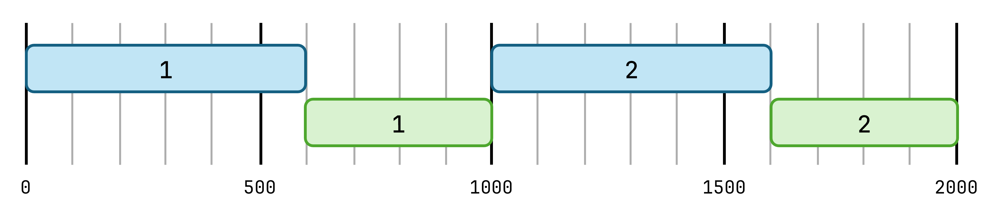
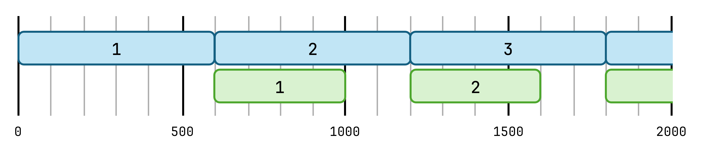
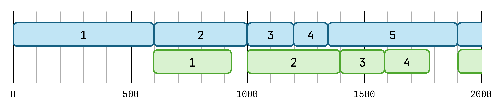
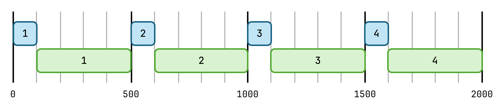
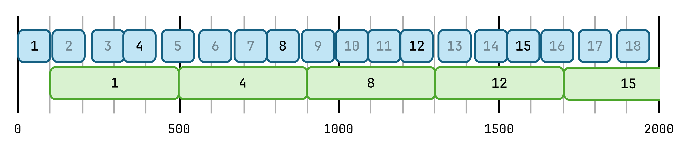
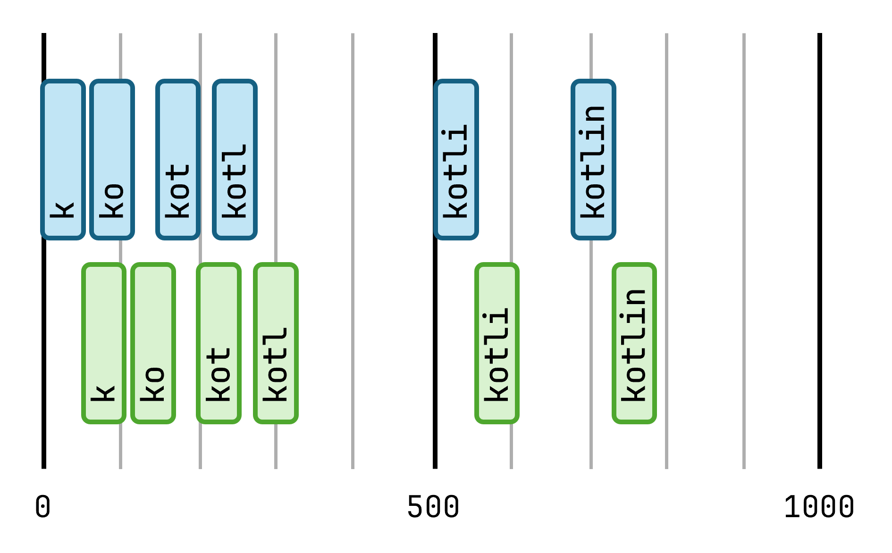
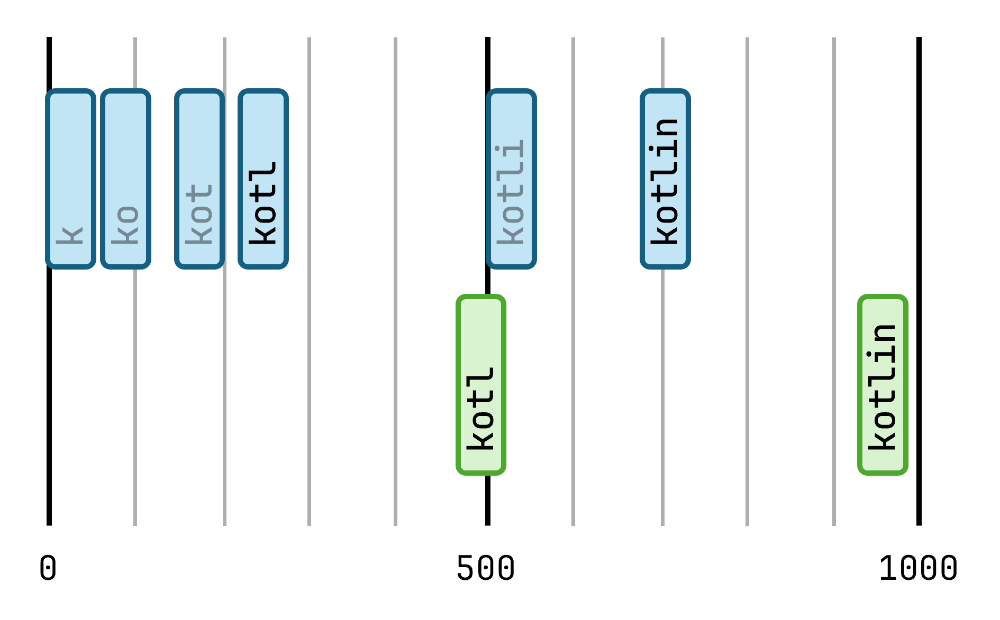

# Chapter 12: Flows

In the [previous chapter](11.md), we've seen how suspending functions can perform asynchronous work and return a value efficiently, without blocking the thread while the call is happening. While this is great for one-time operations, what if you need to return more than a single value? This is where *flows* come into play.

Flows are sequential streams of data built on coroutines. They emit values over time which *collectors* of the flow can receive and process. There are two types of flows, both built on the same APIs:

* *Cold flows* don't perform any work on their own. They're only active when someone is collecting them.
* *Hot flows*, on the other hand, exist independently of their collectors.

We'll discuss both types of flows in this chapter.

## Cold flows

The simplest way to create a cold flow is with the `flow` builder function. Within the lambda passed to `flow`, we're placed in the scope of a `FlowCollector`, and we can call `emit` on it to produce values for collectors.

```kotlin
val flow = flow { // this: FlowCollector<String>
    emit("A")
    emit("B")
    emit("C")
}
```

> The type of the `flow` variable above is `Flow<String>`. Normally, we'd have to specify the type parameter of the builder function (with the `flow<String> {}` syntax), but this isn't required here, as the compiler can tell that we're emitting `String` values later on, inside the builder. This is an advanced form of type inference called [builder inference](https://kotlinlang.org/docs/using-builders-with-builder-inference.html#how-builder-inference-works).

To collect values from a flow, we can call `collect` on it, and pass in a lambda that will be invoked for every value that the flow emits. `collect` is a suspending function, which only returns once the flow it's collecting has completed. Being a suspending function, we need to be in a coroutine to call it:

```kotlin
launch {
    println("Starting collector")
    flow.collect {
        println("Collected $it")
    }
    println("Done collecting!")
}
```

This would output the following:

```
Starting collector
Collected A
Collected B
Collected C
Done collecting!
```

### How cold flows work

Cold flows are deceptively simple under the hood. As mentioned previously, they don't do any work on their own. Instead, all of their behavior is actually driven by the collecting coroutine.

Let's go through the collection of a flow step-by-step:

1. When you call `collect` on a flow, the coroutine you're in enters the body of the block that builds the flow.
2. The coroutine executes code in the builder's body until it reaches an `emit` call.
3. When `emit` is called, we need to let the collector process that value. This happens by `emit` invoking the function you've passed as the parameter to `collect`.
4. Once that call returns, `emit` returns, and we continue executing the body of the flow builder from where we left off. *Go to 2.*
5. When the entire body of the builder has been executed, `collect` returns.

> Thanks to coroutines, we can suspend the builder's code at each `emit` and then continue from that point later.

This all happens in a single coroutine, passing control back-and-forth between the code of the builder and the collector. The numbers below indicate the order of control flow through the statements.

```kotlin
val flow = flow { // this: FlowCollector<String>
    emit("A") // 2
    emit("B") // 4
    emit("C") // 6
}

launch {
    println("Starting collector") // 1
    flow.collect {
        println("Collected $it") // 3, 5, 7
    }
    println("Done collecting!") // 8
}
```

> You can think of the flow builder as a blueprint, which the collector then actually realizes as it goes through the builder's code and handles each emitted value on the collector's side.

### Making suspending calls in flows

As the code passed to the `flow {}` builder is simply a lambda that will be executed by the collecting coroutine, we can write arbitrary code in there, including calls to suspending functions.

For example, we can produce values in a loop, and use `delay` to slow down the production of values:

```kotlin
flow {
    for (i in 1..10) {
        delay(1000)
        emit(i)
    }
}
```

In real application code, we could have more meaningful suspending calls here to produce the data, such as making network calls or reading data from disk.

> As we can write *anything* inside a `flow` builder, we can also easily create infinite flows!

### Multiple collectors

Cold flows can be collected multiple times, and each collector will have its own, completely independent collection of the flow.

> Not to sound like a broken record, but this should make sense based on what learned earlier about how cold flows work. They only provide a definition, it's the collector that does all the work.

```kotlin
val flow = flow {
    for (i in 1..3) {
        delay(1000)
        emit(i)
    }
}

launch {
    flow.collect { println("A: $it") }
}
launch {
    flow.collect { println("B: $it") }
}
```

This prints the following, with a 1 second delay after every two lines of output:

```
A: 1
B: 1
A: 2
B: 2
A: 3
B: 3
```

These collections of the flow are independent, as we really just have two different coroutines running through the same instructions. To further illustrate this:

* If the flow emitted randomized values, coroutines A and B would likely not receive the same values every second.
* If the second coroutine started by delaying itself for 4 seconds, the first coroutine would be done collecting and printing the values before the second one starts at all. Both coroutines would print all 3 emitted values, just not interleaved.
* If one of the collectors performed more work for each item, or introduced a delay on the collector's side, it could take longer for it to collect all the values from the flow.

> Try modifying the code above and running it yourself to see these examples in action!

### Functions that return flows

In the examples above, we created a single instance of a `Flow` and stored it in a variable. Because collectors are independent of each other, it doesn't really matter if they collect one instance multiple times, or if they collect different (identically created) instances.

This means that replacing the variable we had so far with a function that returns a new `Flow` instance each time it's called doesn't change the behavior at all:

```kotlin
fun getFlow(): Flow<Int> = flow {
    for (i in 1..3) {
        delay(1000)
        emit(i)
    }
}

fun main() {
    runBlocking {
        launch {
            getFlow().collect { println("A: $it") }
        }
        launch {
            getFlow().collect { println("B: $it") }
        }
    }
}
```

A function that returns a flow likely doesn't need to be a suspending function itself. Creating an instance of a cold flow should be very fast, as there's no asynchronous work performed until a coroutine starts collecting it.

### Channel flows

Just like coroutines, flow builders are sequential by default. This means you're only supposed to emit values from the main coroutine that's running the collection.

What happens if you try to start additional coroutines inside the builder, to perform some parallelized work and then emit values?

```kotlin
flow {
    for (i in 1..3) {
        coroutineScope {
            launch { emit(i) }
            launch { emit(i) }
        }
    }
}
```

This would be detected by the flow APIs and throw an exception:

```
Exception in thread "main" java.lang.IllegalStateException: Flow invariant is violated:
    Emission from another coroutine is detected.
    Child of StandaloneCoroutine{Active}@77f03bb1, expected child of StandaloneCoroutine{Active}@326de728.
    FlowCollector is not thread-safe and concurrent emissions are prohibited.
    To mitigate this restriction please use 'channelFlow' builder instead of 'flow'
```

Still, there are valid use cases for wanting to create new coroutines to produce values for a flow. While we won't discuss it in detail here, the [`channeFlow`](https://kotlinlang.org/api/kotlinx.coroutines/kotlinx-coroutines-core/kotlinx.coroutines.flow/channel-flow.html) API offers a solution for such situations (as also indicated by the exception).

## Operators

The kotlinx.coroutines library provides a number of operators for flows, much like those available for sequences in the Standard Library.

> As cold and hot flows implement the same `Flow` interface, the operators used by them are exactly the same. To keep things simple, we'll keep looking at cold flows in this section.

To explore operators, let's use a flow that emits a new number every second, going from 1 to 10:

```kotlin
val flow = flow {
    for (i in 1..10) {
        delay(1000)
        emit(i)
    }
}
```

### Basic operators

Using `filter` on a flow creates a new flow, which filters the original flow, by emitting only the values of the original flow that passed the filter's predicate.

```kotlin
flow.filter { it % 2 == 0 }
    .collect { println(it) }
```

This collector will receive the values `2`, `4`, `6`, `8`, and `10`, and will have to wait 2 seconds for each of them, as that's how long the upstream flow takes to produce these values.

The original flow that an operator is applied is called the *upstream flow*, and the new flow returned is called the *downstream* flow. Data flows from top to bottom through the operators.

> Operators used on cold flows are very similar to sequences in this behaviour. Applying operators to them essentially creates an updated blueprint that a coroutine collecting the newly returned flow can execute.

---

Like with collections, we can chain operations easily. For example, we can combine the `filter` above with a `map` operator to multiply each value by 10 after filtering:

```kotlin
flow.filter { it % 2 == 0 }
    .map { it * 10 }
    .collect { println(it) }
```

This will now print `20`, `40`, and so on, still 2 seconds apart.

> Just like with collections and sequences, you are encouraged to explore the many, many available `Flow` operators. You can also usually find the appropriate operator through autocompletion in the IDE.

### Creating a flow operator

While you get lots of useful operators out-of-the-box, you can also implement your own flow operators surprisingly easily (unlike with other, more complex frameworks that provide asynchronous streams).

For example, reimplementing `filter` is as simple as this:

```kotlin
inline fun <T> Flow<T>.filterValues(crossinline predicate: (T) -> Boolean): Flow<T> {
    return flow {
        this@filterValues.collect {
            if (predicate(it)) emit(it)
        }
    }
}
```

This operator uses the `flow {}` builder to create a new flow. Inside the builder, it collects the upstream flow and emits incoming values into the new flow if they pass the predicate.

> This is a great real-life usage of [`crossinline`](4.md#noinline-and-crossinline). We want an `inline` function as we're writing a higher-order function and this avoids a lambda allocation, but the `predicate` is used in a nested context (inside the new flow's builder, which will be executed at some later point in time, after this function has returned) so we can't allow it to perform non-local returns.

---

Another useful building block for custom transformation logic is the [`transform`](https://kotlinlang.org/api/kotlinx.coroutines/kotlinx-coroutines-core/kotlinx.coroutines.flow/transform.html) function, either as the implementation of a custom operator or as part of an operator chain.

This operator essentially combines the `flow` and `collect` calls we've used above, creating a new flow and collecting the upstream flow at the same time. This means you get to emit an arbitrary number of values for each value collected from the upstream flow easily (including zero, one, or more).

The `filter` function could be implemented with a `transform` like this:

```kotlin
inline fun <T> Flow<T>.filterTransform(crossinline predicate: (T) -> Boolean): Flow<T> = transform {
    if (predicate(it)) emit(it)
}
```

For another example, here's a `transform` that splits up strings into individual characters, essentially performing a `flatMap`:

```kotlin
flowOf("flows", "are", "cool")
    .transform { word ->
        for (char in word) {
            emit(char)
        }
    } // Flow<Char>
    .collect(::println) // 'f', 'l', 'o', ..., 'o', 'o', 'l'
```

> `flowOf` is another way to create a cold flow, and is equivalent to a `flow {}` builder call which then just emits each of the listed values in a row.

### Dispatching flows

When working with coroutines, threading is always a primary concern. We've seen in the previous chapter that this is controlled by [dispatchers](11.md#contexts).

By default, the logic of a coroutine builder and any chained operations execute on the dispatcher that the collecting coroutine uses. To move parts of a flow's processing to different dispatchers, you can use the `flowOn` operator.

Using `flowOn` will affect how the *upstream* part of the flow is executed. Operations after the `flowOn` operator will either have their dispatcher specified by downstream operators - either the next `flowOn`, or the final `collect` call.

Take our previous example with filtering and mapping a flow:

```kotlin
launch(Dispatchers.Main) {
    flow
        .filter {
            println("Filtering on ${Thread.currentThread()}")
            it % 2 == 0
        }
        .flowOn(Dispatchers.Default)
        .map {
            println("Mapping on ${Thread.currentThread()}")
            it * 10
        }
        .collect {
            println(it)
        }
}
```

Looking at this chain from the end of it, everything up to the `flowOn` operator (the mapping and the collection) will happen where `collect` was called, on the `Main` dispatcher. Then the `flowOn` operator switches the rest of the upstream flow (the builder's body and the filtering) to run on the `Default` dispatcher.

We can see this in the output as well:

```
Filtering on Thread[#33,DefaultDispatcher-worker-1,5,main]
Filtering on Thread[#33,DefaultDispatcher-worker-1,5,main]
Mapping on Thread[#25,JavaFX Application Thread,5,main]
20
Filtering on Thread[#33,DefaultDispatcher-worker-1,5,main]
Filtering on Thread[#33,DefaultDispatcher-worker-1,5,main]
Mapping on Thread[#25,JavaFX Application Thread,5,main]
40
...
```

### Timely operators

As flows emit values over time, and processing these values on the collector side also takes some amount of time, there are situations where you'll have to think about the pacing of values flowing through your application. The operators we'll look at next deal with typical problems in this space.

#### Buffer

The first scenario is where both the production of a value on the flow side and the processing of the value on the collector side take significant time.

For example, take a flow that takes 600ms to produce a new value, and a collector that takes 400ms to produce each value:

```kotlin
val flow = flow {
    for (i in 1..10) {
        delay(600)
        emit(i)
    }
}

val initial = System.currentTimeMillis()
flow.collect {
    delay(400)
    println("${System.currentTimeMillis() - initial}ms: $it")
}
```

As flows are sequential by default, with control passed back-and-forth between the builder and the collector, this makes the application slower than it needs to be, printing a value about once every 1000ms:

```
1023ms: 1
2037ms: 2
3050ms: 3
4063ms: 4
5069ms: 5
...
```

We can visualize when the producer and the collector are active like this:



To speed this up, we could use the time when a slow collector is processing a value to already start working on the next value on the flow side. This is what the [`buffer`](https://kotlinlang.org/api/kotlinx.coroutines/kotlinx-coroutines-core/kotlinx.coroutines.flow/buffer.html) operator does. It lets the producer continuously emit values even if the collector is busy, which it'll store in a buffer if necessary.

We can add a simple `buffer` call to our previous code:

```kotlin
 flow
    .buffer()
    .collect { ... }
```

Running it again, we'll see that the producer side is no longer held back by the collector, and values are produced approximately every 600ms:

```
1076ms: 1
1668ms: 2
2274ms: 3
2882ms: 4
3486ms: 5
...
```



In the example above, we never had to actually store values in a buffer, as the collector was always faster than the producer. The benefit of buffering was only that we uncoupled the producer and collector, so that they didn't have to wait for each other.

To see some real buffering happening, we could randomize the processing times on both sides. In this case, we'd actually make use of the storage that `buffer` offers whenever the collector isn't ready to process the values immediately when they're produced by the flow. You can see this visualized below, where values `3` and `4` are stored in the buffer until the collector can get to them:



#### Conflate

Another common scenario is a flow producing values faster than you can process them on the collector side:

```kotlin
val flow = flow {
    for (i in 1..50) {
        delay(100)
        emit(i)
    }
}

val initial = System.currentTimeMillis()
flow.collect {
    delay(400)
    println("${System.currentTimeMillis() - initial}ms: $it")
}
```

Running this code, we'll see that the producer is held back significantly by the slow collector:

```
547ms: 1
1059ms: 2
1573ms: 3
2084ms: 4
2596ms: 5
...
```



We could think about using `buffer` again, which would let the producer run continuously and place the values it produces into a buffer until the collector is ready. There are two arguments against doing this:

* If we know that the collector will never catch up, so it doesn't make sense to start buffering values.
* If the values from the flow are time-sensitive (like readings from a sensor), we can't afford to delay processing them more and more as time passes.

Instead of buffering, we can choose to simply drop values when the collector isn't ready to process them, using the [`conflate`](https://kotlinlang.org/api/kotlinx.coroutines/kotlinx-coroutines-core/kotlinx.coroutines.flow/conflate.html) operator:

```kotlin
flow
    .conflate()
    .collect { ... }
```

This conflated flow will let its collector miss some intermediate values, but in return, our collector will always see the latest available values from the flow, processing one every 400ms or so:

```
566ms: 1
970ms: 4
1378ms: 8
1781ms: 12
2184ms: 15
2588ms: 19
...
```



#### Debounce

The [`debounce`](https://kotlinlang.org/api/kotlinx.coroutines/kotlinx-coroutines-core/kotlinx.coroutines.flow/debounce.html) operator lets you avoid unnecessary processing of quickly changing values emitted from a flow. It does this by only re-emitting values from upstream after they've been unchanged for some time.

A typical example of this is handling user input from a keyboard, where we might not want to fire off work (such as network requests for a search query) on every keypress, but only after the user has stopped typing new characters for a moment. This would let us save a lot of unnecessary work.

To emulate this, we'll use a hardcoded flow with delays:

```kotlin
val flow = flow {
    emit("k")
    delay(60)
    emit("ko")
    delay(80)
    emit("kot")
    delay(70)
    emit("kotl")
    delay(290)
    emit("kotli")
    delay(180)
    emit("kotlin")
}

flow.collect { query ->
    println("Searching for $query...")
}
```

This will behave as expected, "running a search" for every keypress:

```
Searching for k...
Searching for ko...
Searching for kot...
Searching for kotl...
Searching for kotli...
Searching for kotlin...
```



We can add the `debounce` operator, which will wait for the specified amount of time before emitting a value further downstream (in this case, it will wait for 200 milliseconds).

```kotlin
flow
    .debounce(200)
    .collect { query ->
        println("Searching for $query...")
    }
```

This will "smooth out" the original flow, and give us the following behaviour by the time we get to collecting the values:

```
Searching for kotl...
Searching for kotlin...
```



As the `debounce` operator has to wait around to make sure that no new values come in, we'll see a small delay between the original emission and the collection of the value.

Choosing a debounce duration is always a balancing act: a value too small might weaken the effect and not skip enough unnecessary work, while a value too large might delay processing too much.

## Hot flows

Unlike cold flows, which are only active when they're collected, hot flows exist independently of their collectors. You can create and store instances of them, and they can emit values even if nobody is collecting them.

> *If a flow emits a value in a forest and no one is around to collect it, does it make a sound?*

Collectors of hot flows are also called *subscribers*.

### SharedFlow

The first hot flow we'll look at is [`SharedFlow`](https://kotlinlang.org/api/kotlinx.coroutines/kotlinx-coroutines-core/kotlinx.coroutines.flow/-shared-flow/), which shares its emitted values with all of its subscribers as a broadcast. This means that all active subscribers receive all emitted values.

Similarly to the collections of the Standard Library, `SharedFlow` is a read-only interface (extending `Flow`), and there's a separate [`MutableSharedFlow`](https://kotlinlang.org/api/kotlinx.coroutines/kotlinx-coroutines-core/kotlinx.coroutines.flow/-mutable-shared-flow/) interface. This also comes with factory functions to create an instance:

```kotlin
val sharedFlow = MutableSharedFlow<Int>()
```

Let's add two subscribers to this flow, and then start sending values to it.

```kotlin
launch {
    sharedFlow.collect { println("A: $it") }
}
launch {
    delay(1000)
    sharedFlow.collect { println("B: $it") }
}

launch {
    sharedFlow.emit(1)
    delay(700)
    sharedFlow.emit(2)
    delay(1000)
    sharedFlow.emit(3)
}
```

This will output the following:

```
A: 1
// 500ms delay ...
A: 2
// 1000ms delay ...
A: 3
B: 3
```

As you can see, subscriber B failed to show up in time to catch the first two emitted values, but it received the third value which was emitted after it started collecting the flow.

If we want to accommodate late subscribers and slow subscribers that might cause `emit` calls to back up (which suspends until the value is processed by all subscribers), we can provide additional parameters when creating the `MutableSharedFlow`:

```kotlin
public fun <T> MutableSharedFlow(
    replay: Int = 0,
    extraBufferCapacity: Int = 0,
    onBufferOverflow: BufferOverflow = BufferOverflow.SUSPEND,
)
```

* `replay` sets the number of latest values that new subscribers should see immediately when subscribing.
* `extraBufferCapacity` can create a buffer in the `SharedFlow` so that `emit` calls can complete even if subscribers are busy and can't process the new value yet.
* `onBufferOverflow` specifies a strategy to use when the buffer (if any) is full. By default, this will make `emit` suspend, but we could also choose to drop the latest or newest value instead.

#### Hot flows never complete

We also ran into another problem with our example: our application hangs, as our collecting coroutines never complete. This is because hot flows never complete, they exist continuously once created and can always emit new values.

In real applications, subscribers are usually tied to an appropriate coroutine scope, for example to a screen in a UI application. When that scope is cancelled, the subscribers contained in it will be automatically cancelled as well.

In examples like this, we can manually cancel these collecting coroutines:

```kotlin
val job = launch {
    sharedFlow.collect { println("A: $it") }
}

...

delay(5000L)

job.cancel()
```

#### Expose read-only flows

In the examples above, we used the `MutableSharedFlow()` constructor to create a `SharedFlow`, and also collected that mutable type directly. In real applications, you often want to expose only the read-only type to potential subscribers, and limit the visibility of the actual mutable `SharedFlow`.

This shows up in code like so:

```kotlin
private val _sharedFlow = MutableSharedFlow<Int>()
val sharedFlow: SharedFlow<Int> = _sharedFlow
```

This code can also be written by using the [`asSharedFlow`](https://kotlinlang.org/api/kotlinx.coroutines/kotlinx-coroutines-core/kotlinx.coroutines.flow/as-shared-flow.html) function, which saves us from specifying an explicit type, and also prevents downcasting the flow by consumers (the `SharedFlow` it returns will fail an `as MutableSharedFlow` cast):

```kotlin
private val _sharedFlow = MutableSharedFlow<Int>()
val sharedFlow = _sharedFlow.asSharedFlow()
```

> [Explicit backing fields](https://github.com/Kotlin/KEEP/blob/explicit-backing-fields-re/proposals/explicit-backing-fields.md) are an upcoming language feature that aim to make this kind of code simpler, allowing you to declare a single property which has a mutable private type and a read-only public type.

> The exact same pattern applies to using `StateFlow`s, which are discussed below.

#### Sharing an existing flow

We've seen above how you can create an instance of `MutableSharedFlow` and emit values into it. A common pattern in applications is accessing data from a source as a `Flow`, which you then want to share with multiple subscribers (so that they don't each need to fetch that data themselves).

> For example, you might have a stream of messages arriving from a single websocket connection, which you then want to distribute to multiple objects in your application which each might want to react to incoming messages.

This can be done "manually", like this:

```kotlin
val sharedFlow = MutableSharedFlow<Int>()
launch {
    flow.collect { value ->
        sharedFlow.emit(value)
    }
}
```

But there's also a dedicated [`shareIn`](https://kotlinlang.org/api/kotlinx.coroutines/kotlinx-coroutines-core/kotlinx.coroutines.flow/share-in.html) function which makes this easier:

```kotlin
val sharedFlow = flow.shareIn(scope, started = SharingStarted.Lazily)
```

This call creates a coroutine in the specified `scope` that collects the underlying `flow` and returns a `SharedFlow`. The `sharing` parameter controls when/how `flow` is collected:

* `Lazily`: Collection starts when the first subscriber of `sharedFlow` appears.
* `Eagerly`: Collection starts immediately when `shareIn` is called.
* `WhileSubscribed(duration)`: Collection starts when the first subscriber appears, and stops if all subscribers disappear. If new subscribers appear again, `flow` will be collected again.

> The `shareIn` operator comes with the benefit that it immediately returns a read-only `SharedFlow`, which might spare you an extra property declaration as well, if you were previously creating a private mutable and a public read-only `SharedFlow` property with the "manual" solution.

### StateFlow

The second hot flow implementation is `StateFlow`, which is an observable state holder that holds onto its latest emitted value.

Similarly to `SharedFlow`, you can create a mutable instance of a `StateFlow` and store it in a variable. Unlike a `SharedFlow` though, a `StateFlow` must always have a current value, so a default value is a required constructor parameter when creating it:

```kotlin
val stateFlow = MutableStateFlow<Int>(0)

launch {
    stateFlow.collect { println(it) } // 0
}
```

As a `StateFlow` holds onto its latest value, new subscribersubscribers are guaranteed to immediately receive a value when they start collecting it.

To update the value of a `StateFlow`, you can use the `value` property:

```kotlin
val stateFlow = MutableStateFlow<Int>(0)
launch {
    stateFlow.collect { println(it) }
}
launch {
    stateFlow.value = 1
    delay(500)
    stateFlow.value = 2
    delay(500)
    stateFlow.value = 3
}
```

The `value` being set will notify any subscribersubscribers of the new value. The subscriber in the example above would print:

```
0
1
2
3
```

While setting `value` is thread-safe and can be done from any coroutine or thread, it's not atomic. A statement such as `stateFlow.value = stateFlow.value + 1` can not guarantee that the `value` hasn't changed between the time of reading and writing it. To make the read and write happen atomically, with a guarantee of no other concurrent modifications, we can use the [`update`](https://kotlinlang.org/api/kotlinx.coroutines/kotlinx-coroutines-core/kotlinx.coroutines.flow/update.html) function instead:

```kotlin
stateFlow.update { i -> i + 1 }
```

> Remember that limiting the visibility of the mutable `StateFlow` object is a best practice, [just like with `SharedFlow`s](#expose-read-only-flows). The [`asStateFlow`](https://kotlinlang.org/api/kotlinx.coroutines/kotlinx-coroutines-core/kotlinx.coroutines.flow/as-state-flow.html) function can come in handy for this.

#### Conflation

As the purpose of `StateFlow` is to hold onto a value, and for its subscribers to be as up-to-date with the latest value as possible. To achieve this, `StateFlow` automatically *conflates* values, in two ways:

* If the same value is set in the `StateFlow` twice (determined by an `equals` comparison), it won't notify subscribers again, as they're already up-to-date on the current state.
* If the stored value is updated rapidly, the `StateFlow` doesn't guarantee that subscribers will see each individual update, it might just deliver the latest value to them.

This can be demonstrated with the following code:

```kotlin
runBlocking {
    val stateFlow = MutableStateFlow<Int>(0)

    launch {
        stateFlow.collect { println(it) }
    }
    launch {
        stateFlow.value = 1
        delay(500)
        stateFlow.value = 1
        delay(500)
        stateFlow.value = 2
        stateFlow.value = 3
    }
}
```

The output here is the following:

```
0
1
3
```

As you can see, the subscriber will receive the initial `0` value of the `StateFlow` immediately, then the `1` when the first delay happens. It won't receive `1` again during the next delay as it's not a new value. It will also miss out on the `2`, and only receive the final `3` value which it was quickly changed to.

> Exactly how conflation happens depends on the dispatchers/schedulers involved. You can learn more about how conflation works and how to deal with it especially in test scenarios [from this article](https://zsmb.co/conflating-stateflows/).

#### "Stating" an existing flow

We often need to convert a regular `Flow` into a `StateFlow`, just like we've [seen earlier](#sharing-an-existing-flow) with `SharedFlow`. 

The "manual" way of doing this would be:

```kotlin
val stateFlow = MutableStateFlow<Int>(0)
launch {
    flow.collect {
        stateFlow.value = it
    }
}
```

We can simplify this by using the [`stateIn`](https://kotlinlang.org/api/kotlinx.coroutines/kotlinx-coroutines-core/kotlinx.coroutines.flow/state-in.html) function, which automatically creates a coroutine to collect the underlying `flow` and place its values into a `StateFlow` for us:

```kotlin
val stateFlow = flow.stateIn(scope, SharingStarted.WhileSubscribed(5000), 0)
```

This has the same parameters as `shareIn`, with an extra required parameter: the default value of the `StateFlow`.

> `SharingStarted.WhileSubscribed(5000)` is a value commonly used in applications (especially Android) to hold UI-related state. This starts collecting the underlying flow when its first subscriber appears, and will wait for up to 5 seconds after its subscribers disappear before it stops collecting and lets the underlying flow free up any resources it's been using.

#### `StateFlow` vs `SharedFlow`

As you can see, `StateFlow` seems to have a lot in common with `SharedFlow`.

* They are both hot flows which can be created once and then continuously exist.
* They have the same split of read-only and mutable interfaces, with the same helper functions (`asSharedFlow`/`asStateFlow`), and the same best practices on how to use them.
* There are utilities to easily collect a regular `Flow` into either of them with `shareIn` or `stateIn`.

We could easily configure a `SharedFlow` to behave just like a `StateFlow`:

```kotlin
val shared = MutableSharedFlow(
    replay = 1,
    onBufferOverflow = BufferOverflow.DROP_OLDEST
)
shared.emit(initialValue)
val state = shared.distinctUntilChanged()
```

* `replay = 1` ensures that new subscribers receive the current state immediately.
* The `DROP_OLDEST` strategy insures we can always immediately set a new value in the flow, without having to suspend.
* The `tryEmit` call sets up the flow with the mandatory initial value.
* [`distinctUntilUnchanged`](https://kotlinlang.org/api/kotlinx.coroutines/kotlinx-coroutines-core/kotlinx.coroutines.flow/distinct-until-changed.html) operator adds conflation.

In fact, `StateFlow` is actually a `SharedFlow`, as it implements that interface:

```kotlin
public interface StateFlow<out T> : SharedFlow<T>
```

While you could just use a `SharedFlow` instead of a `StateFlow` directly, `StateFlow` exists as a separate type because `MutableStateFlow` offers a high-performance, efficient implementation built for this narrow, special case of holding a single state value.

## Summary

Flows are reactive streams of data, built on top of coroutines. They come in two variations: cold and hot flows. With cold flows, collectors do all the work, while the flows are simply a description of how to produce values when they're collected. Hot flows, on the other hand exist independently of their subscribers.

Flow APIs look similar to collections and sequences: they use a split of read-only and mutable interfaces, and they come with a convenient set of built-in operators to transform values. You can also create your own operators relatively easily.

`SharedFlow` has broadcast behaviour, while `StateFlow` is specialized to serve as an observable state holder.

## Sources

* [KotlinConf 2019: Asynchronous Data Streams with Kotlin Flow by Roman Elizarov](https://www.youtube.com/watch?v=tYcqn48SMT8)
* Medium articles by Roman Elizarov
  * [Cold flows, hot channels](https://elizarov.medium.com/cold-flows-hot-channels-d74769805f9)
  * [Simple design of Kotlin Flow](https://elizarov.medium.com/simple-design-of-kotlin-flow-4725e7398c4c)
  * [Kotlin Flows and Coroutines](https://elizarov.medium.com/kotlin-flows-and-coroutines-256260fb3bdb)
