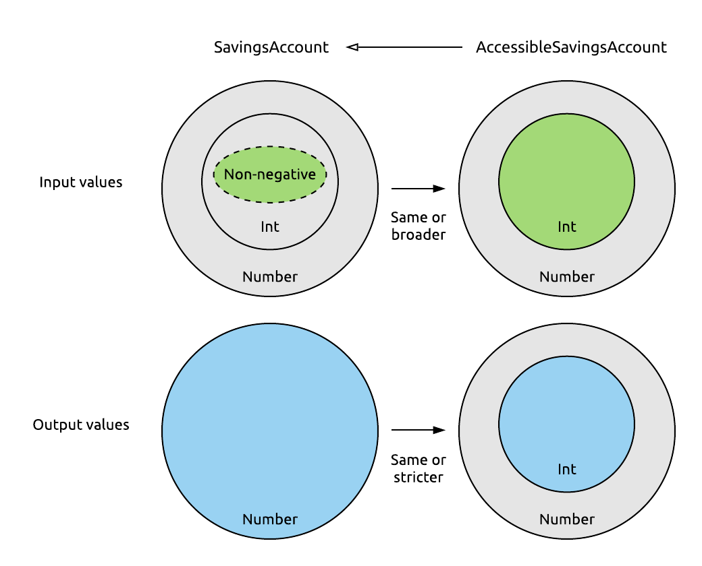

# Chapter 9: The Type System

Thanks to Kotlin's strong typing, we rely on its type system to write safe code every time we're using the language - probably more than you realize. Now it's time to examine this type system, get familiar with its special types, and learn about its mechanisms in detail.

## A closer look at the type system

> This discussion of the type system is based in part on [this original article](https://zsmb.co/posts/typical-kotlin/).

First things first, what exactly is a *type*? Types are what let us - and the compiler - define expectations for any given object. What properties and methods can be called on it, where it can be passed as a parameter, where it can be assigned.

Every variable, property, parameter, and expression has a type in Kotlin which is known at compile time. This static typing is what guarantees that, for example, no calls are made to non-existent functions. This eliminates a whole class of possible runtime errors that might occur in dynamically typed languages.

> This is a good time to briefly reflect on the problems of null handling in Java again. The core problem there is actually all about types! If the `String` type offers certain members that you can access on its instances, `null` should really not be considered a valid value for a `String`, as it can't meet the expectations we have for a `String`.

It's important to note that types are **not** equivalent to classes. We are creating new types every time we declare a class, interface, object, or typealias (going forward, we'll stick mostly to just classes for simplicity). In fact, in all of these cases, we're creating multiple new types with these declarations. Let's take just the case of a boring, empty class:

```kotlin
class Hello
```

By defining this class, we've already created the `Hello` and `Hello?` types. These are separate and very different types, as the compiler forces us to explicitly handle the possible nullability of a `Hello?`, while letting us use a `Hello` relatively freely in comparison, since it knows it's always safe to do so.

Creating a class with a type parameter introduces yet more types:

```kotlin
class List<T>
```

In fact, this unbounded `T` type parameter introduces infinitely many types. Some of these would be `List<String>`, `List<String>?`, `List<String?>`, `List<String?>?`, `List<List<Int>>`, `List<in String>`, `List<*>`... Just to mention a few. (Don't worry, we'll take a look at what all of these are later in this chapter!)

### The `Any` type

Like classes, types exist in a hierarchy. We'll put aside nullable types for a moment, and look at just the hierarchy of non-nullable types. This looks essentially the same as the hierarchy formed by the respective classes that create these types.


The root of Kotlin's type hierarchy is the `Any` type (just like the [`Any`](https://kotlinlang.org/api/latest/jvm/stdlib/kotlin/-any/) class is the root of its class hierarchy). This type defines basic functions such as `equals`, `hashCode`, and `toString`, which are available on all object instances in Kotlin, as they all have `Any` as their supertype.

Classes with no explicit superclass inherit directly from the `Any` class, and therefore the (non-nullable) types produced by these classes are direct subtypes of the `Any` type. An example of this is the `Hello` class we've defined earlier. As Kotlin doesn't distinguish between primitives and wrappers, the basic types (`Int`, `Double`, `Boolean`, etc.) are also subtypes of `Any`.

> The number types aren't *direct* subtypes of `Any`, but instead they are subtypes of [`Number`](https://kotlinlang.org/api/latest/jvm/stdlib/kotlin/-number/), which defines common functionality for numerical types.

### Subtyping

We've used the words *subtype* and *supertype* in this previous section, so it's time that we clarify what these words mean.

*Y is a subtype of X if an object of type Y can be used in any place where an X is expected.*

This requirement is twofold. On one hand, it's a technical requirement, which the type system can verify for us. For a concrete example, we know that if we create a `Car` superclass and then inherit from it with a `Tesla` class, then the compiler lets us pass a `Tesla` to a function that expects to operate on a `Car`:

```kotlin
open class Car
class Tesla : Car()

fun drive(car: Car) {
    println("Driving the $car, vroom vroom")
}

drive(Tesla())
```

We tend to summarize why this works in a very simplistic phrase: a `Tesla` *is a* `Car`. However, inheriting from the base class with the syntax `: Car()` isn't really what makes a `Tesla` a `Car`.

The other requirement for this subtyping to be correct is for the `Tesla` class to *fulfill the contract of a `Car`*. If we have a reference of type `Car` which points to a `Tesla` instance, we should be able to call methods on this object and get behaviour consistent with what we expect from the base `Car` type. This is one of the SOLID principles, namely, the [Liskov substitution principle](https://en.wikipedia.org/wiki/Liskov_substitution_principle).

> This second requirement can technically be broken, and it's rather easy to break it. Doing so is a code smell called *refused bequest* - a class inheriting from another class, without upholding its contract. This is usually a misguided effort to reuse code from the superclass. You'll find this discussed in Effective Java in detail, in *Item 18: Favor composition over inheritance*.

Let's have `Car` contain a method that lets us drive it for a given number of miles, and returns the gallons of fuel consumed as a result. For any method, its *contract* consists of the set of input values it can accept, plus the promises it makes about its return values. For this one, we could say that its parameter `miles` always has to be non-negative `Int`, and what it promises for its return value is that it'll be some kind of `Number`.

We can put these requirements into code like this:

```kotlin
open class Car {
    open fun drive(miles: Int): Number {
        require(miles >= 0)
        // Compute & return some default consumption value...
    }
}
```

Note how both of these are restrictions on sets of values. The input is first restricted to values of a single type, `Int`, and then even further restricted by specifying what values within that type may be used. The first of these is enforced by the compiler, and since the type system can't enforce the latter, the best we can do is perform a runtime check for it ourselves.

> We're sticking with an `Int` here for the sake of the example. We could of course use a [`UInt`](https://kotlinlang.org/api/latest/jvm/stdlib/kotlin/-u-int/) to exclude negative values.

Similarly, the output has the restriction that out of all possible types of objects, it has to be a `Number`. This is only a type restriction, so it can be enforced entirely by the compiler.

What happens when we override a method like this in a subtype? We are required to hold up the contract it originally had, as someone might use our `Tesla` as a `Car` at some point (and not just a Netflix player).

The easy way to remember the Liskov principle is with this short phrase: **expect no more, provide no less**.

**Expect no more.** We can't define stricter expectations for inputs than our superclass did, as we have to be able to process everything that the superclass is able to process. We can usually make our input requirements looser, if we want: for our concrete example, we might choose to allow negative values in the subclass. (Assuming that we don't consider an exception being thrown for negative values part of the contract of `Car`!)

**Provide no less.** For our output, we have to provide at least as much as the superclass, which means that we have to provide a `Number`. We may also provide a more concrete type, for example, always an `Int`. This will always fulfill the needs of clients who expect to receive a `Number` from this method.

```kotlin
class Tesla : Car() {
    override fun drive(miles: Int): Int {
        return 0 // No gallons consumed, duh!
    }
}
```

We can even change the method signature in this subclass to the more concrete return type, as you can see in this previous code snippet.

> Interestingly, we can't make our input parameters have less concrete types in the override - this is explained neatly [here](https://typealias.com/concepts/contravariance/#functions).



One last time, for proper subtyping, during inheritance:

- The set of accepted values may only broaden - preconditions can only be equal or weaker. **Expect no more.**
- The set of returned values may only shrink - postconditions can only be equal or stricter. **Provide no less.**

### The parallel nullable and non-nullable type hierarchies

Now, let's see how nullable types fit into the picture of our type system. The relation of a given type and its counterpart is fairly simple to determine. The non-nullable type is a more concrete type, as it can only accept a subset of the values that the nullable type can (all of them except for `null`).


Applying this to every type in our type hierarchy, we get two tightly connected parallel hierarchies, which we can visualize like so:


Looking at this, we can see that the *real* root of the entire type hierarchy is the `Any?` type. A variable of type `Any?` is able to store an object of any type - pun intended.

We can take a moment to check if all the indirect relations between types also make sense. As an example, we see that `Double` is a subtype of `Number?`, according to the diagram. This makes sense, since a `Double` really does produce all the behaviour that is expected from a `Number?`. We might also have the intuition that an object of type `Double` can be safely stored in a variable of type `Number?`.

### Elvis revisited

With our newly developed knowledge of the type hierarchy of Kotlin, we can get more familiar with a feature that we've already been using for a while - the Elvis operator.

This operator is most often used to handle cases where a value is `null` and we have to use a substitute value in its place. If its left-hand side is `null`, it will simply return the right-hand side. What about the return type of the entire *Elvis expression* though?

Most often, we use the Elvis operator to provide a non-nullable value that has the "same type" as the left-hand side:

```kotlin
val maybeString: String? = null
val definitelyString = maybeString ?: "replacement"
```

This is the straightforward case, and `definitelyString` will simply have the type `String` inferred here, as we're expecting it.

But how does the compiler choose the correct type for an Elvis expression? What if we use different types on the two sides of the operator, and not just the nullable and non-nullable variant of the same type?

Let's answer these questions by looking at some examples. Here's a small, simple type hierarchy we'll be using for these:


##### Both nullable 

Let's evaluate an Elvis expression between a `Dog?` and a `Horse?` type first. I'll be using this notation to describe this task:


First, we find these types in the hierarchy:


Now we have to figure out what type the Elvis expression above will return. As our first guess, let's take *the first common supertype of these two sides* and see if that works.


We got `Animal?` as our type for the entire expression created by the Elvis operator. This seems fine. We'll either have a `Dog` or a `Horse`, plus they might be `null`, and an `Animal?` can hold all of these possible values - and we can check one by one that no other, more concrete type can do so. If we verify our result - for example, in IntelliJ with type inference - we'll see that we have indeed found the correct return type.

##### Right nullable

Here's our next example to evaluate - we've changed the left-hand side to a non-nullable type.


We can find these types quickly now:


Again, we'll take the first common supertype, as this worked well for us before, and we have no reason to doubt it. We could take multiple routes from `Dog` to `Animal?` here, however, this doesn't affect the end result.


We have a few more jumps now, but the result seems sensible. If we check in IntelliJ, we are again correct as far as the return type of an expression like this goes.

If we take a step back however, we'll also find that the Elvis operator is simply redundant in this case - the left side can never be `null`! Nevertheless, if we were to still write this down and not heed the IDE's warnings to remove the redundant Elvis operator, we'd get `Animal?` as the return type.

##### Left nullable

As a non-nullable type on the left side makes no sense, we'll get to our last combination of nullabilities for the two sides:


We identify the types in the hierarchy:


And we take the first common supertype of these two. Again, we could take multiple routes from `Horse` to `Animal?`, but it *is* the first common supertype.


Something has gone wrong here. If we take a moment to think, we'll find the nullable result of `Animal?` to be overly cautious. If the left-hand side of the expression happens to be `null`, we'll be using the right-hand side instead, which will give us a non-nullable `Horse` value. If the left side is not `null`, we get a non-nullable `Dog` as the result.

This means that `Animal` would be a perfectly reasonable result for the expression as well. What went wrong, how did we get a nullable type when none is needed? Our mistake was to treat the left side as nullable, even though an Elvis expression will never return `null` from that side.

To fix this, we'll adjust our "algorithm": we'll take the non-nullable version of the type on the left, and the type on the right as-is, and find the first common supertype of *these* two types.


In our case, this means first taking `Dog?` back to the non-nullable side of the hierarchy to `Dog`, and then finding the first common supertype with `Horse`, which, as expected, will now be the correct `Animal` type.

This is the correct way of determining the return type of an Elvis expression. We'll see why it's useful to be familiar with this later.

### Unit

`Unit` is a special type in Kotlin that we've already encountered in the very first chapter. It's worth taking another look at it though.

The documentation describes it as *the type with only one value*. As far as its code goes, this is achieved simply by declaring `Unit` as a singleton `object`. Here's its entire source:

```kotlin
public object Unit {
    override fun toString() = "kotlin.Unit"
}
```

This of course wouldn't be enough for `Unit` to do all the things it does, there's also quite a bit of special treatment by the compiler involved to achieve its functionality.

The most important of these is that functions that return no meaningful value return `Unit` instead in Kotlin. This is a meaningless return value (as it's an empty object), but this way, all functions work semantically the same way: they all return something. In comparison, Java has to give special treatment to `void` returning functions - for example, we can't assign their return type to a variable.

We'll get back to `Unit` when discussing generics in the [next chapter](./10.md#the-usefulness-of-unit).

### Nothing

#### A value that never exists

[`Nothing`](https://kotlinlang.org/api/latest/jvm/stdlib/kotlin/-nothing.html) may look a lot like `Unit` at first glance. `Nothing` is a class that can never be instantiated. This is backed by its very short source:

```kotlin 
public class Nothing private constructor()
```

This in itself leads to some interesting consequences for using `Nothing`. For example, if a function has `Nothing` as its return type, we know that it can never return, since it has no way of acquiring or creating the instance of `Nothing` it would return. This, again, is different from `Unit`-returning functions - those did return something, that value just wasn't meaningful.

What does a function that never returns look like? It might contain an infinite loop, or it might always throw an exception instead of terminating normally:

```kotlin
fun loopy(): Nothing {
    while (true) {
        println("Loop!")
    }
}

fun exceptional(): Nothing {
    throw IllegalStateException()
}
```

The Kotlin compiler allows both of these functions to compile since it understands control flow and sees that neither will ever reach a `return` statement. Of course, both of these could just return `Unit`, but this way, we can signal to client code that they will never return.

Why would we want to do this? For example, because the IDE can now warn callers about code that's placed after a call to these `Nothing`-returning functions, which will never be executed:


#### `Nothing` as a bottom type

The `Nothing` type gets some additional special treatment from the compiler. Since an instance of it can never exist, it can serve in the type system as a [bottom type](https://en.wikipedia.org/wiki/Bottom_type).

> In subtyping systems, the *bottom type* is the subtype of all types.

This updates our overall hierarchy like so:


Why and how can `Nothing` serve this purpose? Think about it for a second - anywhere you need a concrete type, be it an `Int`, a `Dog`, or an [`AbstractSingletonProxyFactoryBean`](https://docs.spring.io/spring-framework/docs/current/javadoc-api/org/springframework/aop/framework/AbstractSingletonProxyFactoryBean.html), it's safe to pass in something that has the type `Nothing`, because you know that this code can never actually be reached. 

For example, the `loopy` function shown above will never return properly, which makes this variable assignment and then the call to this `processData` function completely safe to compile, albeit nonsensical:

```kotlin
fun processData(data: List<String>) {
    // Use data
}

fun main() {
    val data: Nothing = loopy()
    processData(data)
}
```

We see that the specific type of `processData`'s parameter doesn't matter. It could be any arbitrary type, and `Nothing` could still be passed in safely (as it will never actually be passed in!).

Let's move on to a use case where we can make more sensible use of `Nothing` being a bottom type.

#### TODO

The Standard Library's [`TODO()`](https://kotlinlang.org/api/latest/jvm/stdlib/kotlin/-t-o-d-o.html) function is a great example of making use of `Nothing`. It's a never-returning function, because it always throws a `NotImplementedError`. Since the compiler knows that it never returns, it allows you to leave functions half-implemented like this, without making you return a value:

```kotlin
fun getValue(): Int {
    TODO("implement later")
}
```

> In Java, you would have to `return 0;` or `return null;` in these non-implemented functions like these temporarily to make them compile, which you might forget about later on.

Since `Nothing` is a bottom type, you can also return `TODO()` from any function regardless of what the return type is, and you can use it as a placeholder for any function parameter as well:

```kotlin
fun calculate(x: Int): Int = TODO()

calculate(TODO())
```

All these usages of `TODO` will crash before returning, reminding you that this part of the code is not implemented yet.

> IntelliJ IDEA also picks up invocations of this function the same way that it picks up comments containing "TODO", so you can view them on the same panel.

#### Nothing ft. Elvis

We're going to bring two previous topics together now, `Nothing` and the Elvis operator.

Consider what happens when you use an `Elvis` operator with something of type `Nothing` on the right-hand side. If the expression's left side ends up being non-null, that's the result of the expression, and we can continue on with our code. However, if we have to evaluate the "default" right side, execution of whatever function we're in is guaranteed to be halted, as evaluating that side will either never terminate, or will terminate with an exception.

Let's reuse the `Nothing`-returning `exceptional` function defined above for this example:

```kotlin
fun calculate(someParam: Int?) {
    val x = someParam ?: exceptional()
    val y = x * 2
    println(y)
}
```

Notice that we are using `x` as an `Int` on the third line where we're multiplying it. This code compiles and works correctly, despite the parameter having a type of `Int?`. This makes sense intuitively. If we were to run into the right-hand side case of the Elvis expression and call the `exceptional` function, `calculate` would not proceed due to the exception thrown from there, and otherwise we have a non-null `Int` on our hands.

However, let's be precise and take a look at the type hierarchy again, and see what the return type of the Elvis expression should be:


First, we take `Int?` back to the non-nullable hierarchy, and then we find the first common supertype of `Int` and `Nothing`... Which, since `Nothing` is a bottom type, is `Int` itself! Notice that the same would happen for any nullable type on the left of the Elvis operator when there's `Nothing` on its right side: the return type of the expression would just be the non-nullable variant of the type on the left.

This is already a quite nice way to handle `null` cases of certain values by throwing an exception, and have them be available on the next line conveniently as the non-null variant of their original type. 

We don't even need to wrap throwing an exception into a function that returns `Nothing`. Like many other built-in constructs, `throw` is actually an expression in Kotlin, and naturally, its return type is `Nothing`. This lets us do simply this:

```kotlin
fun calculate(someParam: Int?) {
    val x = someParam ?: throw IllegalArgumentException("someParam must not be null")
    val y = x * 2
    println(y)
}
```

There's another very handy little expression that can be used here for a different effect - the `return` expression. This lets us stop execution of this function for an invalid argument silently.

```kotlin
fun calculate(someParam: Int?) {
    val x = someParam ?: return
    val y = x * 2
    println(y)
}
```

Of course, we're creating a new variable here that's essentially the same as our parameter. This is both wasteful and somewhat confusing, especially in a longer function. Here's a neat trick that's common practice in Kotlin:

```kotlin
fun calculate(someParam: Int?) {
    someParam ?: return
    val y = someParam * 2
    println(y)
}
```

Why does this still work? Because the Elvis expression (as every other expression) will be evaluated even when its return value is unused, and if the parameter was `null`, it returns from the function. From the next line, `someParam` will be available as an `Int` due to a smart cast. (This of course can be used the same way with a `throw`.)

#### throw return

An interesting quirk of both `return` and `throw` having a type of `Nothing` is that statements like this are perfectly valid in Kotlin:

```kotlin
fun oddity() {
    throw return return throw return
}
```

Why is this? Well, both `return` and `throw` take an argument that needs to be evaluated before they're executed. `throw` takes a `Throwable`, and `return` takes whatever the return type of the given function is - in this case, it's `Unit`, which is applied implicitly as a special case, but the same line would compile even if the function returned an `Int`, as long as we ended it with something like `return 1`.

So, for the first `throw` to be executed, it needs a `Throwable` as an argument. The `return` expression right after it returns `Nothing`, which of course *is* a `Throwable`. Similarly, whatever the function's return type, writing either `throw` or `return` down after a `return` keyword will pass type checks, because `Nothing` will fit that return type.

Now we know why this compiles, but what happens when we run the code? The first expression needs its argument evaluated, which in turn needs its argument evaluated, and so on. At the end of this chain, only the very last expression will be executed, because whether it's a `throw` or a `return`, it will exit the current function. The operations before it on the line, which were "in the queue" to be executed, will never have a chance to take effect.

Now you know how to return values and throw exceptions *in style*.

#### About `Nothing?`

When introducing `Nothing` as a bottom type, we've updated our type hierarchy with two new types, but all we've discussed so far was the non-nullable `Nothing`. Does the nullable type `Nothing?` make any sense, and is it of any use to us?


It's a subtype of all nullable types, which would mean that a value of type `Nothing?` could be used anywhere where a nullable value is required. We know exactly one value that fits this description - `null` itself.

We can confirm our suspicion by assigning `null` to a variable, and letting type inference do its job:

```kotlin
val x = null
```

From here, we can check with either reflection or through the IDE's tooling that `x`, in fact, is of the type `Nothing?`.

```kotlin
val x: Nothing? = null
```

You almost never want to declare a variable like this, because you'll never be able to assign anything but `null` to it.

Here's the common example of how you might run into issues with this:

```kotlin
var x = null
x = "this is a string" // e: Type mismatch. Required: Nothing? Found: String
```

Although there's a type that would work perfectly well here for both usages of `x` (the nullable `String?`), letting the compiler infer the type in this scenario leaves us with a scary-at-first error message seen above.

Hopefully going forward this won't scare you, and you'll realize quickly that inference is to blame, and you can fix the issue by explicitly typing `x` as a `String?`:

```kotlin
var x: String? = null
x = "this is a string"
```

## Summary

The Kotlin type system is perhaps the most important part of the language. It's the source of the safety that pervades the language. It provides safe null handing, well-defined subtyping, and powerful support for advanced generics (which we'll take a look at in the next chapter).

## Sources

- [Typical Kotlin](https://zsmb.co/posts/typical-kotlin/)
